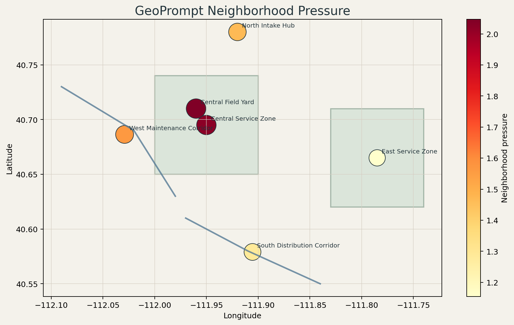

# Geoprompt

Custom spatial analysis package for point, line, and polygon workflows, GeoPandas-style frame access, GeoJSON-compatible inputs and outputs, CRS-aware reprojection, spatial joins, geographic distance options, and GeoPrompt-specific equations for influence, interaction, corridor strength, and neighborhood pressure.



## Snapshot

- Lane: Spatial package design
- Domain: Reusable custom spatial analysis
- Stack: Python, JSON fixtures, lightweight geometry frame, custom equations
- Includes: GeoPromptFrame object, mixed-geometry helpers, GeoJSON I/O, CRS metadata and reprojection, Euclidean and haversine distance tools, bounding-box queries, radius queries, within-distance predicates, spatial joins, proximity joins, buffer, buffer joins, coverage summaries, dissolve, clip and overlay intersections, nearest-neighbor analysis, comparison report tooling, custom influence equations, benchmark corpus, demo report, tests

## Overview

This project starts a reusable spatial package lane instead of another one-off analysis repo. The goal is to build a custom package that users can import directly, similar to how they would reach for GeoPandas, but focused first on a small and clear set of spatial equations that can grow over time.

The initial version still stays intentionally simple, but it now goes beyond points: the frame can work with points, lines, and polygons represented through a small GeoJSON-like geometry mapping. That keeps the package small enough to iterate on while still showing a real package design direction.

## What It Demonstrates

- A package-first project structure rather than a single lab script
- A `GeoPromptFrame` object that behaves like a lightweight spatial table wrapper
- GeoJSON FeatureCollection support so callers can use standard spatial data without reshaping it first
- Custom equations for spatial decay, influence, interaction, corridor strength, and area similarity scoring
- Basic nearest-neighbor analysis for point, line, and polygon centroids
- Bounding-box queries for quick map-window style filtering
- Radius queries for fast proximity filtering around a feature or coordinate anchor
- Within-distance predicates for scoring or filtering without materializing a join
- CRS assignment and reprojection through `GeoPromptFrame.to_crs(...)`
- Spatial joins with `intersects`, `within`, and `contains` predicates
- Proximity joins for distance-based matching without needing an overlay engine
- Buffer generation for point, line, and polygon geometries through the overlay engine
- Buffer joins for service-area style matching against surrounding features
- Coverage summaries for fast count and aggregate rollups per service geometry
- Dissolve workflows with `GeoPromptFrame.dissolve(...)`
- Overlay operations with `GeoPromptFrame.clip(...)` and `GeoPromptFrame.overlay_intersections(...)`
- Geographic distance support for longitude/latitude point workflows through haversine distance
- Pairwise interaction analysis without requiring pandas or geopandas
- A demo CLI that exports a real review plot and JSON report from checked-in mixed geometry features
- A comparison CLI that checks Geoprompt outputs against Shapely and GeoPandas across a built-in corpus and records timing data

## Example Usage

```python
import geoprompt as gp

frame = gp.read_points("data/sample_points.json")
scored = frame.assign(
    neighborhood_pressure=lambda current: current.neighborhood_pressure(
        weight_column="demand_index",
        scale=0.14,
        power=1.6,
    )
)

print(scored.head(2))
print(scored.centroid())
print(scored.nearest_neighbors())
```

Mixed geometry example:

```python
import geoprompt as gp

features = gp.read_features("data/sample_features.json")
print(features.geometry_types())
print(features.geometry_lengths())
print(features.geometry_areas())
print(features.query_bounds(-111.97, 40.68, -111.84, 40.79).head())
projected = features.set_crs("EPSG:4326").to_crs("EPSG:3857")
print(projected.bounds())
print(features.nearest_neighbors(k=2)[:4])
```

Spatial join example:

```python
import geoprompt as gp

regions = gp.read_features("data/benchmark_regions.json", crs="EPSG:4326")
assets = gp.read_features("data/benchmark_features.json", crs="EPSG:4326")
joined = regions.spatial_join(assets, predicate="contains")

print(joined.head(3))
```

Proximity query and join example:

```python
import geoprompt as gp

assets = gp.read_features("data/benchmark_features.json", crs="EPSG:4326")
regions = gp.read_features("data/benchmark_regions.json", crs="EPSG:4326")

nearby = assets.query_radius(anchor="alpha-point", max_distance=0.06)
proximity = regions.proximity_join(assets, max_distance=0.08)

print(nearby.head(3))
print(proximity.head(3))
```

Buffer and within-distance example:

```python
import geoprompt as gp

assets = gp.read_features("data/sample_features.json", crs="EPSG:4326")

mask = assets.within_distance(anchor="north-hub-point", max_distance=0.08)
buffers = assets.buffer(distance=0.01)

print(mask)
print(buffers.head(2))
```

Service-area example:

```python
import geoprompt as gp

origins = gp.read_features("data/sample_features.json", crs="EPSG:4326")
targets = gp.read_features("data/benchmark_features.json", crs="EPSG:4326")

service_matches = origins.buffer_join(targets, distance=0.03)
coverage = origins.buffer(distance=0.03).coverage_summary(
    targets,
    aggregations={"demand_index": "sum"},
)

print(service_matches.head(3))
print(coverage.head(3))
```

Overlay example:

```python
import geoprompt as gp

regions = gp.read_features("data/benchmark_regions.json", crs="EPSG:4326")
assets = gp.read_features("data/benchmark_features.json", crs="EPSG:4326")

clipped = assets.clip(regions)
intersections = regions.overlay_intersections(assets)

print(clipped.head(3))
print(intersections.head(3))
```

Dissolve example:

```python
import geoprompt as gp

regions = gp.read_features("data/benchmark_regions.json", crs="EPSG:4326")
dissolved = regions.dissolve(by="region_band", aggregations={"region_name": "count"})

print(dissolved.head())
```

GeoJSON example:

```python
import geoprompt as gp

frame = gp.read_geojson("service-zones.geojson")
nearest = frame.nearest_neighbors(k=1)
nearest_km = frame.nearest_neighbors(k=1, distance_method="haversine")
gp.write_geojson("service-zones-scored.geojson", frame)

print(nearest)
print(nearest_km)
```

## Project Structure

```text
geoprompt/
|-- data/
|   |-- benchmark_features.json
|   |-- benchmark_regions.json
|   |-- sample_features.json
|   `-- sample_points.json
|-- assets/
|   `-- neighborhood-pressure-review-live.png
|-- .github/
|   `-- workflows/
|       `-- geoprompt-ci.yml
|-- src/geoprompt/
|   |-- __init__.py
|   |-- compare.py
|   |-- demo.py
|   |-- geometry.py
|   |-- overlay.py
|   |-- equations.py
|   |-- frame.py
|   `-- io.py
|-- tests/
|   `-- test_geoprompt.py
|-- docs/
|   |-- architecture.md
|   `-- demo-storyboard.md
|-- outputs/
|   |-- charts/
|   |   `-- .gitkeep
|   `-- .gitkeep
|-- pyproject.toml
`-- README.md
```

## Quick Start

```bash
pip install -e .[dev]
geoprompt-demo
```

Install the optional comparison stack when you want to validate against Shapely and GeoPandas:

```bash
pip install -e .[compare]
geoprompt-compare
```

Install only projection support if you want CRS transforms without the full comparison stack:

```bash
pip install -e .[projection]
```

Install only overlay support if you want clip and intersection operations without the full comparison stack:

```bash
pip install -e .[overlay]
```

Install the published package from PyPI with:

```bash
pip install geoprompt
```

Run tests:

```bash
pytest
```

## Current Output

The default demo command writes `outputs/geoprompt_demo_report.json` and `outputs/charts/neighborhood-pressure-review.png` with:

- a frame-level centroid and bounds summary
- CRS and projected Web Mercator bounds metadata
- mixed geometry type summaries, line lengths, and polygon areas
- nearest-neighbor rows for each feature in planar and geographic modes
- per-site neighborhood pressure scores
- anchor influence scores from a selected source node
- corridor accessibility scores for line-style features
- top pairwise interaction rows ranked by the GeoPrompt interaction equation
- top area-similarity rows ranked across polygon-like features
- a bounding-box query count for the default valley review window
- a GeoJSON export in `outputs/geoprompt_demo_features.geojson`
- a committed pressure plot in `assets/neighborhood-pressure-review-live.png`

CI validation is defined in `.github/workflows/geoprompt-ci.yml` and runs tests, demo generation, comparison validation, and package builds.
It also runs `python -m twine check dist/*` so distribution metadata is validated before release.

See [docs/architecture.md](docs/architecture.md) for the package design notes.
See [docs/demo-storyboard.md](docs/demo-storyboard.md) for the reviewer walkthrough.

## Custom Equations

- Prompt decay: `1 / (1 + distance / scale) ^ power`
- Prompt influence: `weight * prompt_decay(distance, scale, power)`
- Prompt interaction: `origin_weight * destination_weight * prompt_decay(distance, scale, power)`
- Corridor strength: `weight * log(1 + corridor_length) * prompt_decay(distance, scale, power)`
- Area similarity: `min(area_a, area_b) / max(area_a, area_b) * prompt_decay(distance, scale, power)`

These are intentionally simple first equations. The package now supports two distance modes:

- `euclidean` for planar coordinate space and direct comparison with Shapely and GeoPandas raw-coordinate results
- `haversine` for geographic point-to-point distances in kilometers when your coordinates are longitude/latitude

The package now supports CRS tagging and reprojection, but it is still designed so richer CRS handling, overlays, and additional operators can be layered in later.

## Package Interface

The main package entry points are:

- `geoprompt.read_points(...)`
- `geoprompt.read_features(...)`
- `geoprompt.read_geojson(...)`
- `geoprompt.write_geojson(...)`
- `geoprompt.haversine_distance(...)`
- `GeoPromptFrame.set_crs(...)`
- `GeoPromptFrame.to_crs(...)`
- `GeoPromptFrame.nearest_neighbors(...)`
- `GeoPromptFrame.query_bounds(...)`
- `GeoPromptFrame.query_radius(...)`
- `GeoPromptFrame.within_distance(...)`
- `GeoPromptFrame.spatial_join(...)`
- `GeoPromptFrame.proximity_join(...)`
- `GeoPromptFrame.buffer(...)`
- `GeoPromptFrame.buffer_join(...)`
- `GeoPromptFrame.coverage_summary(...)`
- `GeoPromptFrame.dissolve(...)`
- `GeoPromptFrame.clip(...)`
- `GeoPromptFrame.overlay_intersections(...)`
- `GeoPromptFrame.neighborhood_pressure(...)`
- `GeoPromptFrame.anchor_influence(...)`
- `GeoPromptFrame.corridor_accessibility(...)`
- `GeoPromptFrame.interaction_table(...)`
- `GeoPromptFrame.area_similarity_table(...)`

## Comparison Workflow

Before calling Geoprompt production-ready, use the comparison CLI to verify results and get a timing snapshot against Shapely and GeoPandas:

```bash
geoprompt-compare
```

This writes `outputs/geoprompt_comparison_report.json` with:

- core metric agreement across the built-in sample and benchmark corpora
- core metric agreement across a generated stress corpus with 93 features and 16 join regions
- reprojection agreement against GeoPandas in EPSG:3857
- dissolve agreement against GeoPandas on the benchmark region corpus
- spatial-join agreement against Shapely and GeoPandas-style predicate behavior
- nearest-neighbor agreement against a Shapely centroid-distance reference
- bounding-box query agreement against GeoPandas
- timing summaries for geometry metrics, reprojection, bounds queries, nearest neighbors, dissolve, clip, and joins

Current validated snapshot from the built-in corpora:

- correctness parity flags are all `true` for bounds, nearest neighbors, bounds queries, geometry metrics, reprojection, clip, dissolve, and spatial join
- Geoprompt is consistently faster on geometry metrics, nearest-neighbor lookup, bounds queries, and dissolve
- the generated stress corpus currently shows Geoprompt ahead on spatial join and still behind the reference stack on clip
- the smaller benchmark corpus still shows clip and spatial join as the main optimization targets even after the latest bounds-prefilter pass

Representative relative speed ratios from the latest comparison report:

- `sample` corpus: geometry metrics `6.66x`, nearest neighbors `5.28x`, bounds query `30.28x`, reprojection `1.47x`
- `benchmark` corpus: geometry metrics `5.10x`, nearest neighbors `5.57x`, bounds query `14.58x`, reprojection `1.38x`, clip `0.68x`, spatial join `0.60x`, dissolve `17.40x`
- `stress` corpus: geometry metrics `3.44x`, nearest neighbors `6.50x`, bounds query `1.29x`, reprojection `1.19x`, clip `0.89x`, spatial join `2.50x`, dissolve `5.97x`

## Release Readiness

The project now includes:

- an MIT license in `LICENSE`
- a GitHub Actions workflow for repeatable validation
- a checked-in benchmark corpus for broader parity testing
- packaging extras for comparison, projection, and overlay support

## Publication

- License: [LICENSE](LICENSE)
- Standalone publishing notes: [PUBLISHING.md](PUBLISHING.md)
- Changelog: [CHANGELOG.md](CHANGELOG.md)
- Release notes: [docs/release-notes-0.1.4.md](docs/release-notes-0.1.4.md)

## Repository Notes

This copy is intended to be publishable as its own repository.