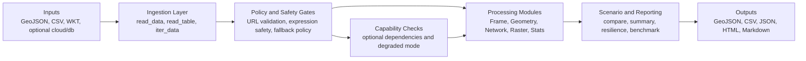

# GeoPrompt

> Spatial analysis package for point, line, polygon, and multi-part geometry workflows — lightweight native frame API, GeoJSON-compatible I/O, CRS-aware reprojection, WKT tabular ingestion, spatial joins, geographic distance, and GeoPrompt-specific equations for influence, interaction, corridor strength, and neighborhood pressure.

[](https://github.com/matthew-lottly/geoprompt/actions/workflows/geoprompt-ci.yml)
[](https://pypi.org/project/geoprompt/)
[](https://pypi.org/project/geoprompt/)
[](LICENSE)
[](#release-readiness)

---

## End-to-End Flow



This flow chart is intentionally kept in Mermaid so it renders directly on GitHub and stays diff-friendly in pull requests.

---

## Neighborhood Pressure — Live Output

<p align="center">
  
</p>

<p align="center"><em>Neighborhood pressure scores computed on mixed-geometry features — points sized and colored by score, service-zone polygons shown as bounding extents, corridor line geometry overlaid. Generated from <code>geoprompt-demo</code> against the built-in sample corpus.</em></p>

---

## Documentation

| Category | Link |
|---|---|
| Getting started | [Start here](docs/start-here.md) · [Quickstart cookbook](docs/quickstart-cookbook.md) |
| API | [API stability](docs/api-stability.md) · [Reference guide](docs/reference-api.md) |
| Workflows | [Flagship workflows](docs/flagship-workflows.md) · [Network recipes](docs/network-scenario-recipes.md) · [Connectors and recipes](docs/connectors-and-recipes.md) |
| Outputs and reporting | [Notebook gallery](docs/notebook-gallery.md) · [Benchmarks and proof](docs/benchmarks.md) · [Output columns](docs/output-columns.md) |
| Interop | [GeoPandas interop](docs/geopandas-interop-and-reporting.md) · [Migration from GeoPandas](docs/migration-from-geopandas.md) · [Migration from ArcPy](docs/migration-from-arcpy.md) |
| Environment | [Optional dependencies](docs/environment-and-optional-dependencies.md) · [Deployment guide](docs/deployment-guide.md) |
| Trust and security | [Threat model](docs/threat-model.md) · [Exception taxonomy](docs/exception-taxonomy.md) · [API architecture](docs/API_ARCHITECTURE.md) |
| Extension and governance | [Extending GeoPrompt](docs/extending-geoprompt.md) · [Governance and support](docs/governance-and-support.md) |
| Help | [Troubleshooting](docs/troubleshooting.md) · [When to use GeoPrompt](docs/when-to-use-geoprompt.md) |

---

## Maturity Tiers

GeoPrompt uses runtime tier labels to distinguish hardened workflows from exploratory ones.

| Tier | Status | Examples |
|---|---|---|
| **Stable** | Verified and recommended for production analyst workflows | `frame`, `geometry`, `network`, scenario reporting |
| **Beta** | Supported when relevant extras are installed | `viz`, `db`, `raster`, `service`, `compare` |
| **Experimental** | Useful but still evolving | Advanced domain, ML, and imagery helpers |
| **Simulation-only** | Scaffolding or integration starter — not a production backend | Notification stubs, SAML metadata stub, serverless endpoint stub |

Use stable and beta tiers for stakeholder-facing work. Treat simulation-only helpers as integration starters only. Run `geoprompt capability-report` to see which optional dependencies are active in your environment.

---

## Why GeoPrompt

GeoPrompt is built for the full analyst-to-decision-support workflow: scenario comparison, resilience screening, routing, report generation, and stakeholder-ready outputs from a single package surface. It does not require GeoPandas or matplotlib for core workflows — plotting, mapping, and richer interop stay in optional extras.

Choose GeoPrompt when you need:
- Mixed-geometry workflows (points, lines, polygons, multi-part) without a GIS desktop dependency
- Scenario comparison and resilience reporting as first-class outputs, not post-processing steps
- Transparent trust semantics — capability guards, fallback warnings, and degraded-mode detection built in
- A lightweight frame API that handles CRS, spatial joins, dissolve, overlay, and network analysis under one import

## Install Profiles

```bash
# Core — no GeoPandas or matplotlib required
pip install geoprompt

# Developer tooling
pip install geoprompt[dev]

# Analyst workflow stack
pip install geoprompt[analyst]

# Notebook workflows
pip install geoprompt[notebook]

# Optional stacks
pip install geoprompt[network]      # network-heavy workloads
pip install geoprompt[viz]          # visualization stack
pip install geoprompt[io]           # geospatial I/O (fsspec, cloud)
pip install geoprompt[db]           # database connectors
pip install geoprompt[overlay]      # clip and intersection operations
pip install geoprompt[compare]      # benchmark comparison extras
pip install geoprompt[excel]        # Excel helpers

# Full feature stack
pip install geoprompt[all]
```

## Container Quick Start

A starter [Dockerfile](Dockerfile) is included for reproducible runs:

```bash
docker build -t geoprompt .
docker run --rm geoprompt geoprompt-demo --help
```

## Snapshot

- Lane: Spatial package design
- Domain: Reusable custom spatial analysis
- Stack: Python, JSON fixtures, lightweight geometry frame, custom equations
- Includes: GeoPromptFrame object, mixed-geometry helpers with multi-part support, GeoJSON and WKT-friendly I/O, normalized CRS metadata and reprojection, Euclidean and haversine distance tools, bounding-box queries, reusable bounds indexing, indexed Euclidean joins (with optional non-indexed baseline mode), radius queries, within-distance predicates, spatial joins, proximity joins, nearest joins, nearest assignment workflows, assignment summaries, catchment competition, corridor reach, overlay summaries, zone-fit scoring, multi-scale clustering, buffer, buffer joins, coverage summaries, dissolve, clip and overlay intersections, nearest-neighbor analysis, PromptTable outputs for model/report workflows (filter/join/pivot/summarize/JSON/HTML export), geometry validity and repair helpers, single- and multi-scenario report tooling, benchmark proof bundles, network resilience auditing, staged restoration planning, custom influence equations, benchmark corpus, demo report, tests

## Overview

This project starts a reusable spatial package lane instead of another one-off analysis repo. The goal is to build a custom package that users can import directly through its own lightweight frame and workflow surface, focused first on a small and clear set of spatial equations that can grow over time.

The initial version still stays intentionally simple, but it now goes beyond points: the frame can work with points, lines, polygons, and multi-part geometry represented through a small GeoJSON-like geometry mapping. It also accepts common WKT geometry strings in tabular inputs. That keeps the package small enough to iterate on while still showing a real package design direction.

## What It Demonstrates

- A package-first project structure rather than a single lab script
- A lower-case `geopromptframe` API that behaves like a lightweight spatial table wrapper
- GeoJSON FeatureCollection support so callers can use standard spatial data without reshaping it first
- Custom equations for spatial decay, influence, interaction, corridor strength, and area similarity scoring
- Basic nearest-neighbor analysis for point, line, and polygon centroids
- Bounding-box queries for quick map-window style filtering, with reusable spatial indexing for repeated windows
- Indexed Euclidean nearest, proximity, and spatial joins for repeated right-side search workloads
- Radius queries for fast proximity filtering around a feature or coordinate anchor
- Within-distance predicates for scoring or filtering without materializing a join
- CRS assignment and reprojection through `GeoPromptFrame.to_crs(...)`
- Spatial joins with `intersects`, `within`, and `contains` predicates
- Proximity joins for distance-based matching without needing an overlay engine
- Nearest joins for `k` closest matches when you want ranked association instead of a fixed distance cutoff
- Nearest assignment for allocating each target feature to a single closest origin
- Assignment summaries for rolling nearest assignments into per-origin counts, ids, and aggregate metrics
- Buffer generation for point, line, and polygon geometries through the overlay engine
- Buffer joins for service-area style matching against surrounding features
- Coverage summaries for fast count and aggregate rollups per service geometry
- Dissolve workflows with `GeoPromptFrame.dissolve(...)`
- Overlay operations with `GeoPromptFrame.clip(...)` and `GeoPromptFrame.overlay_intersections(...)`
- Geographic distance support for longitude/latitude point workflows through haversine distance
- Pairwise interaction analysis without requiring pandas or geopandas
- A demo CLI that exports a real review plot and JSON report from checked-in mixed geometry features
- A comparison CLI that checks Geoprompt outputs against Shapely and GeoPandas across a built-in corpus and records timing data

## Example Usage

Unified data-loading example using checked-in sample inputs (GeoJSON, CSV/TSV, WKT-backed tables, and optional geospatial files):

```python
from pathlib import Path
import geoprompt as gp

root = Path(".")
output_dir = root / "outputs"
output_dir.mkdir(exist_ok=True)

# GeoJSON / JSON FeatureCollection
features = gp.read_data(root / "data" / "sample_features.json", limit_rows=100000)

# CSV with point columns
points = gp.read_data(
    root / "data" / "sample_assets.csv",
    x_column="longitude",
    y_column="latitude",
    use_columns=["asset_id", "longitude", "latitude", "demand"],
)

# Tabular WKT geometry column
shapes = gp.read_table(
    root / "data" / "sample_assets_with_wkt.csv",
    geometry_column="shape",
)

# Optional geospatial formats (requires geopandas extras): .shp, .gpkg, .gdb, .fgb
# parcels = gp.read_data("city.gdb", layer="parcels", bbox=(-112.1, 40.5, -111.7, 40.9))

gp.write_data(output_dir / "points_out.csv", points)
gp.write_data(output_dir / "features_out.geojson", features)

# Chunked iteration for very large datasets
for chunk in gp.iter_data(root / "data" / "sample_assets.csv", x_column="longitude", y_column="latitude", chunk_size=2):
    _ = chunk.head(1)

# Preset-driven wrappers for larger workloads
preset_frame = gp.read_data_with_preset(
    root / "data" / "sample_assets.csv",
    preset="large",
    x_column="longitude",
    y_column="latitude",
)

for chunk in gp.iter_data_with_preset(
    root / "data" / "sample_assets.csv",
    preset="huge",
    x_column="longitude",
    y_column="latitude",
):
    _ = chunk.head(1)
```

Example output (abridged):

```text
features rows: 6
points columns: ['asset_id', 'longitude', 'latitude', 'demand', 'geometry']
shapes geometry types: ['LineString', 'Polygon', 'MultiPolygon']
chunk head: [{'asset_id': 'a-001', 'demand': 42.0}]
preset_frame rows: 6
```

Network batch preset example:

```python
from geoprompt.network import od_cost_matrix_with_preset, utility_bottlenecks_with_preset

matrix = od_cost_matrix_with_preset(
    graph,
    origins=origin_nodes,
    destinations=destination_nodes,
    preset="large",
)

bottlenecks = utility_bottlenecks_with_preset(
    graph,
    od_demands=((o, d, q) for o, d, q in huge_demands),
    preset="huge",
)
```

Example output (abridged):

```text
od matrix rows: 120
od matrix sample: {'origin': 'substation-a', 'destination': 'zone-12', 'cost': 7.4}
bottlenecks sample: {'edge_id': 'sw-18', 'utilization': 0.94, 'risk_band': 'high'}
```

Resilience and restoration example:

```python
from geoprompt.network import (
    multi_source_service_audit,
    outage_impact_report,
    restoration_sequence_report,
    supply_redundancy_audit,
)
from geoprompt.tools import (
    build_resilience_portfolio_report,
    build_resilience_summary_report,
    export_resilience_portfolio_report,
    export_resilience_summary_report,
)

redundancy = supply_redundancy_audit(
    graph,
    source_nodes=["substation-a", "tie-source"],
    demand_by_node=node_demands,
    critical_nodes=["hospital-1", "water-plant"],
)
service_audit = multi_source_service_audit(
    graph,
    source_nodes=["substation-a", "tie-source"],
    demand_by_node=node_demands,
    source_capacity_by_node={"substation-a": 80.0, "tie-source": 60.0},
)
outage = outage_impact_report(
    graph,
    source_nodes=["substation-a"],
    failed_edges=["sw-12", "sw-18"],
    demand_by_node=node_demands,
    customer_count_by_node=customer_counts,
    critical_nodes=["hospital-1"],
)
staging = restoration_sequence_report(
    graph,
    source_nodes=["substation-a"],
    failed_edges=["sw-12", "sw-18"],
    demand_by_node=node_demands,
    critical_nodes=["hospital-1"],
)
report = build_resilience_summary_report(redundancy, outage_report=outage, restoration_report=staging)
portfolio = build_resilience_portfolio_report({"baseline": report, "upgrade": report})
export_resilience_summary_report(report, "outputs/resilience-summary.html")
export_resilience_portfolio_report(portfolio, "outputs/resilience-portfolio.html")
```

Example output (abridged):

```text
redundancy score: 0.83
outage customers_impacted: 342
restoration critical_nodes_restored_first: ['hospital-1']
written: outputs/resilience-summary.html
written: outputs/resilience-portfolio.html
```

Optional interop bridge example:

```python
import geoprompt as gp

frame = gp.geopromptframe.from_records(
    [{"site_id": "a", "geometry": {"type": "Point", "coordinates": (-111.9, 40.7)}}],
    crs="EPSG:4326",
)

if gp.geopandas_available():
    geodataframe = gp.to_geopandas(frame)
    restored = gp.from_geopandas(geodataframe)

report = gp.build_scenario_report(
    baseline_metrics={"served_load": 180.0, "deficit": 0.12},
    candidate_metrics={"served_load": 205.0, "deficit": 0.05},
    higher_is_better=["served_load"],
    uncertainty={"served_load": {"lower": 198.0, "observed": 205.0, "upper": 212.0}},
)
gp.export_scenario_report(report, "outputs/scenario-report.html")
report_table = gp.scenario_report_table(report)
summary = report_table.summarize("direction", {"delta_percent": "mean"})

scores = gp.batch_accessibility_scores(
    supply_rows=[[200.0, 100.0, 30.0]],
    travel_cost_rows=[[0.5, 1.0, 2.5]],
    decay_method="exponential",
    rate=0.6,
)

index = frame.build_spatial_index()
window = frame.query_bounds_indexed(-112.0, 40.6, -111.8, 40.8, spatial_index=index)
joined = frame.proximity_join(frame, max_distance=0.08)
ranked = frame.sort_values("site_id")
filtered = frame.where(site_id="a")
frame.to_json("outputs/frame.json")
```

Benchmark proof bundle example:

```python
import geoprompt as gp
from pathlib import Path

# Requires compare extras: pip install geoprompt[compare]
report = gp.build_comparison_report(output_dir=Path("outputs"))
summary = gp.benchmark_summary_table(report)
written = gp.export_comparison_bundle(report, Path("outputs"))

print(summary.head(5))
print(written)
```

Example output (abridged):

```text
Checks passed: 8/8
Corpora: sample, benchmark, stress
Representative ratios: geometry_metrics 1.48x faster, dissolve 10.15x faster
Bundle paths: outputs/geoprompt_comparison_report.json, outputs/geoprompt_comparison_summary.md, outputs/geoprompt_comparison_summary.html
```

```python
import geoprompt as gp

frame = gp.read_points("data/sample_points.json")
scored = frame.assign(
    neighborhood_pressure=lambda current: current.neighborhood_pressure(
        weight_column="demand_index",
        scale=0.14,
        power=1.6,
    )
)

print(scored.head(2))
print(scored.centroid())
print(scored.nearest_neighbors())
```

Mixed geometry example:

```python
import geoprompt as gp

features = gp.read_features("data/sample_features.json")
print(features.geometry_types())
print(features.geometry_lengths())
print(features.geometry_areas())
print(features.query_bounds(-111.97, 40.68, -111.84, 40.79).head())
projected = features.set_crs("EPSG:4326").to_crs("EPSG:3857")
print(projected.bounds())
print(features.nearest_neighbors(k=2)[:4])
clusters = features.multi_scale_clustering(distance_threshold=0.08)
print(clusters.head(2))
```

Spatial join example:

```python
import geoprompt as gp

regions = gp.read_features("data/benchmark_regions.json", crs="EPSG:4326")
assets = gp.read_features("data/benchmark_features.json", crs="EPSG:4326")
joined = regions.spatial_join(assets, predicate="contains")

print(joined.head(3))
```

Example output (abridged):

```text
3 rows x 12 columns
region_name    asset_id      predicate
north-band     alpha-point   contains
north-band     beta-line     contains
core-band      gamma-poly    contains
```

Proximity query and join example:

```python
import geoprompt as gp

assets = gp.read_features("data/benchmark_features.json", crs="EPSG:4326")
regions = gp.read_features("data/benchmark_regions.json", crs="EPSG:4326")

nearby = assets.query_radius(anchor="alpha-point", max_distance=0.06, use_spatial_index=True)
proximity = regions.proximity_join(assets, max_distance=0.08)

print(nearby.head(3))
print(proximity.head(3))
```

Example output (abridged):

```text
nearby rows: 2
proximity rows: 7
```

Nearest-join example:

```python
import geoprompt as gp

origins = gp.read_features("data/sample_features.json", crs="EPSG:4326")
targets = gp.read_features("data/benchmark_features.json", crs="EPSG:4326")

nearest = origins.nearest_join(targets, k=2, max_distance=0.08, how="left")

print(nearest.head(4))
```

Nearest-assignment example:

```python
import geoprompt as gp

origins = gp.read_features("data/sample_features.json", crs="EPSG:4326")
targets = gp.read_features("data/benchmark_features.json", crs="EPSG:4326")

assigned = origins.assign_nearest(targets, max_distance=0.08, how="left")

print(assigned.head(4))
```

Assignment-summary example:

```python
import geoprompt as gp

origins = gp.read_features("data/sample_features.json", crs="EPSG:4326")
targets = gp.read_features("data/benchmark_features.json", crs="EPSG:4326")

summary = origins.summarize_assignments(
    targets,
    aggregations={"demand_index": "sum"},
    max_distance=0.08,
)

print(summary.head(4))
```

Buffer and within-distance example:

```python
import geoprompt as gp

assets = gp.read_features("data/sample_features.json", crs="EPSG:4326")

mask = assets.within_distance(anchor="north-hub-point", max_distance=0.08)
buffers = assets.buffer(distance=0.01)

print(mask)
print(buffers.head(2))
```

Service-area example:

```python
import geoprompt as gp

origins = gp.read_features("data/sample_features.json", crs="EPSG:4326")
targets = gp.read_features("data/benchmark_features.json", crs="EPSG:4326")

service_matches = origins.buffer_join(targets, distance=0.03)
coverage = origins.buffer(distance=0.03).coverage_summary(
    targets,
    aggregations={"demand_index": "sum"},
)

print(service_matches.head(3))
print(coverage.head(3))
```

Overlay example:

```python
import geoprompt as gp

regions = gp.read_features("data/benchmark_regions.json", crs="EPSG:4326")
assets = gp.read_features("data/benchmark_features.json", crs="EPSG:4326")

clipped = assets.clip(regions)
intersections = regions.overlay_intersections(assets)

print(clipped.head(3))
print(intersections.head(3))
```

Dissolve example:

```python
import geoprompt as gp

regions = gp.read_features("data/benchmark_regions.json", crs="EPSG:4326")
dissolved = regions.dissolve(by="region_band", aggregations={"region_name": "count"})

print(dissolved.head())
```

GeoJSON example:

```python
import geoprompt as gp

frame = gp.read_geojson("service-zones.geojson")
nearest = frame.nearest_neighbors(k=1)
nearest_km = frame.nearest_neighbors(k=1, distance_method="haversine")
gp.write_geojson("service-zones-scored.geojson", frame)

print(nearest)
print(nearest_km)
```

## Project Structure

```text
geoprompt/
|-- data/
|   |-- benchmark_features.json
|   |-- benchmark_regions.json
|   |-- sample_assets.csv
|   |-- sample_assets_with_wkt.csv
|   |-- sample_features.json
|   `-- sample_points.json
|-- assets/
|   |-- before-after-scenario-example.svg
|   |-- neighborhood-pressure-review-live.png
|   |-- portfolio-scorecard-example.svg
|   `-- restoration-storyboard-example.svg
|-- docs/
|   |-- api-stability.md
|   |-- benchmarks.md
|   |-- connectors-and-recipes.md
|   |-- flagship-workflows.md
|   |-- notebook-gallery.md
|   |-- quickstart-cookbook.md
|   |-- reference-api.md
|   `-- start-here.md
|-- examples/
|   |-- benchmark_report_bundle.py
|   |-- geopandas_roundtrip_report.py
|   |-- network/
|   |-- notebooks/
|   `-- personas/
|-- src/geoprompt/
|   |-- ai.py
|   |-- cartography.py
|   |-- cli.py
|   |-- compare.py
|   |-- data_management.py
|   |-- db.py
|   |-- ecosystem.py
|   |-- enterprise.py
|   |-- frame.py
|   |-- geometry.py
|   |-- io.py
|   |-- raster.py
|   |-- service.py
|   |-- stats.py
|   |-- temporal.py
|   |-- tools.py
|   |-- viz.py
|   `-- network/
|-- tests/
|   |-- test_geoprompt.py
|   |-- test_network.py
|   |-- test_network_robustness.py
|   `-- test_tools_advanced.py
|-- CHANGELOG.md
|-- pyproject.toml
`-- README.md
```

## Quick Start

```bash
pip install -e .[dev]
geoprompt-demo
```

Install the optional comparison stack when you want to validate against Shapely and GeoPandas:

```bash
pip install -e .[compare]
geoprompt-compare
```

Install only projection support if you want CRS transforms without the full comparison stack:

```bash
pip install -e .[projection]
```

Install only overlay support if you want clip and intersection operations without the full comparison stack:

```bash
pip install -e .[overlay]
```

Install the published package from PyPI with:

```bash
pip install geoprompt
```

Run tests:

```bash
pytest
```

## Current Output

The default demo command writes `outputs/geoprompt_demo_report.json` and `outputs/charts/neighborhood-pressure-review.png` with:

- a frame-level centroid and bounds summary
- CRS and projected Web Mercator bounds metadata
- mixed geometry type summaries, line lengths, and polygon areas
- nearest-neighbor rows for each feature in planar and geographic modes
- per-site neighborhood pressure scores
- anchor influence scores from a selected source node
- corridor accessibility scores for line-style features
- top pairwise interaction rows ranked by the GeoPrompt interaction equation
- top area-similarity rows ranked across polygon-like features
- a bounding-box query count for the default valley review window
- a GeoJSON export in `outputs/geoprompt_demo_features.geojson`
- a committed pressure plot in `assets/neighborhood-pressure-review-live.png`

CI validation is defined in `.github/workflows/geoprompt-ci.yml` and runs tests, demo generation, comparison validation, and package builds.
It also runs `python -m twine check dist/*` so distribution metadata is validated before release.

See [docs/architecture.md](docs/architecture.md) for the package design notes.
See [docs/demo-storyboard.md](docs/demo-storyboard.md) for the reviewer walkthrough.

## Custom Equations

- Prompt decay: `1 / (1 + distance / scale) ^ power`
- Prompt influence: `weight * prompt_decay(distance, scale, power)`
- Prompt interaction: `origin_weight * destination_weight * prompt_decay(distance, scale, power)`
- Corridor strength: `weight * log(1 + corridor_length) * prompt_decay(distance, scale, power)`
- Area similarity: `min(area_a, area_b) / max(area_a, area_b) * prompt_decay(distance, scale, power)`

These are intentionally simple first equations. The package now supports two distance modes:

- `euclidean` for planar coordinate space and direct comparison with Shapely and GeoPandas raw-coordinate results
- `haversine` for geographic point-to-point distances in kilometers when your coordinates are longitude/latitude

The package now supports CRS tagging and reprojection, but it is still designed so richer CRS handling, overlays, and additional operators can be layered in later.

## Package Interface

The main package entry points are:

- `geoprompt.read_points(...)`
- `geoprompt.read_features(...)`
- `geoprompt.read_geojson(...)`
- `geoprompt.write_geojson(...)`
- `geoprompt.haversine_distance(...)`
- `GeoPromptFrame.set_crs(...)`
- `GeoPromptFrame.to_crs(...)`
- `GeoPromptFrame.nearest_neighbors(...)`
- `GeoPromptFrame.query_bounds(...)`
- `GeoPromptFrame.query_radius(...)`
- `GeoPromptFrame.within_distance(...)`
- `GeoPromptFrame.spatial_join(...)`
- `GeoPromptFrame.proximity_join(...)`
- `GeoPromptFrame.nearest_join(...)`
- `GeoPromptFrame.assign_nearest(...)`
- `GeoPromptFrame.summarize_assignments(...)`
- `GeoPromptFrame.buffer(...)`
- `GeoPromptFrame.buffer_join(...)`
- `GeoPromptFrame.coverage_summary(...)`
- `GeoPromptFrame.dissolve(...)`
- `GeoPromptFrame.clip(...)`
- `GeoPromptFrame.overlay_intersections(...)`
- `GeoPromptFrame.neighborhood_pressure(...)`
- `GeoPromptFrame.anchor_influence(...)`
- `GeoPromptFrame.corridor_accessibility(...)`
- `GeoPromptFrame.interaction_table(...)`
- `GeoPromptFrame.area_similarity_table(...)`

## Comparison Workflow

Before calling Geoprompt production-ready, use the comparison CLI to verify results and get a timing snapshot against Shapely and GeoPandas:

```bash
geoprompt-compare
```

This writes `outputs/geoprompt_comparison_report.json` with:

- core metric agreement across the built-in sample and benchmark corpora
- core metric agreement across a generated stress corpus with 93 features and 16 join regions
- reprojection agreement against GeoPandas in EPSG:3857
- dissolve agreement against GeoPandas on the benchmark region corpus
- spatial-join agreement against Shapely and GeoPandas-style predicate behavior
- nearest-neighbor agreement against a Shapely centroid-distance reference
- bounding-box query agreement against GeoPandas
- timing summaries for geometry metrics, reprojection, bounds queries, nearest neighbors, dissolve, clip, and joins

Current validated snapshot from the built-in corpora:

- correctness parity flags are all `true` for bounds, nearest neighbors, bounds queries, geometry metrics, reprojection, clip, dissolve, and spatial join
- Geoprompt is consistently faster on geometry metrics, nearest-neighbor lookup, bounds queries, and dissolve
- the generated stress corpus now shows Geoprompt ahead on both spatial join and clip
- the smaller benchmark corpus still shows `clip` and `spatial_join` trailing the reference path, which is the clearest target for the next optimization pass

Representative relative speed ratios from the latest comparison report:

- `sample` corpus: geometry metrics `5.09x`, nearest neighbors `2.16x`, bounds query `23.86x`, reprojection `1.58x`
- `benchmark` corpus: geometry metrics `10.35x`, nearest neighbors `4.44x`, bounds query `9.32x`, reprojection `1.18x`, clip `0.78x`, spatial join `0.37x`, dissolve `19.68x`
- `stress` corpus: geometry metrics `6.98x`, nearest neighbors `9.25x`, bounds query `3.41x`, reprojection `1.17x`, clip `1.20x`, spatial join `3.18x`, dissolve `7.96x`

## Trust and Capability Transparency

GeoPrompt includes a runtime capability system that guards optional dependency paths and surfaces degraded-mode behavior explicitly rather than silently falling back.

```python
import geoprompt as gp

# See which optional dependencies are active
report = gp.capability_report()
print(report["enabled"])
print(report["disabled"])
```

Or from the CLI:

```bash
geoprompt capability-report
```

Key trust properties:
- Optional dependency absence emits `FallbackWarning` — never silently returns wrong results
- `FallbackPolicy.ERROR` mode raises `DependencyError` on any degraded-path call
- Expression evaluation uses an AST allowlist — no `eval()` on user-supplied strings in production paths
- All HMAC-signed service requests, PII scanning, and payload complexity limits are configurable via environment variables
- Release evidence ratchets (broad-except count, raw ImportError count, skip budget) are CI-gated

See [docs/environment-and-optional-dependencies.md](docs/environment-and-optional-dependencies.md) and [docs/threat-model.md](docs/threat-model.md) for full details.

---

## Release Readiness

The project now includes:

- an MIT license in `LICENSE`
- a GitHub Actions workflow for repeatable validation
- a checked-in benchmark corpus for broader parity testing
- packaging extras for comparison, projection, and overlay support

## Publication

- License: [LICENSE](LICENSE)
- Standalone publishing notes: [PUBLISHING.md](PUBLISHING.md)
- Changelog: [CHANGELOG.md](CHANGELOG.md)
- Latest changes: [CHANGELOG.md](CHANGELOG.md)

## Repository Notes

This copy is intended to be publishable as its own repository.
