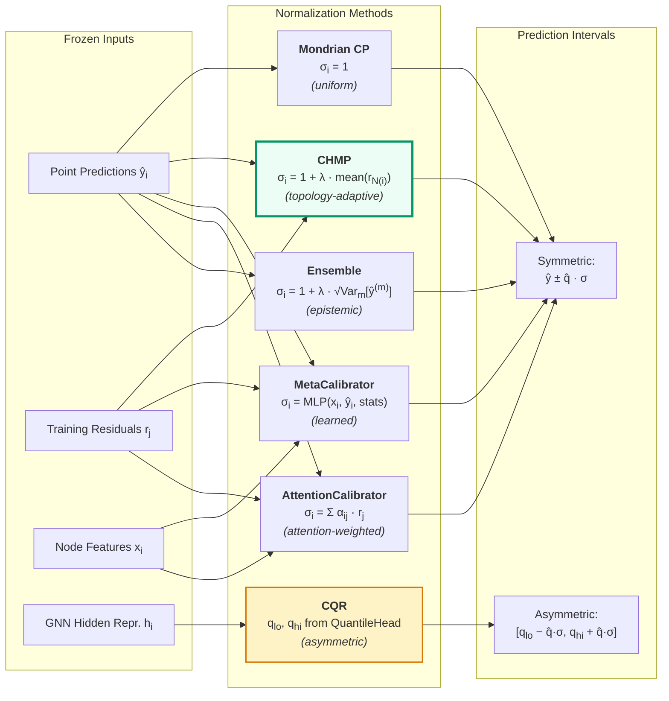
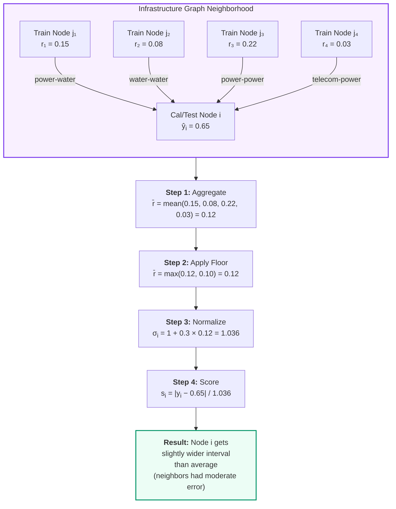
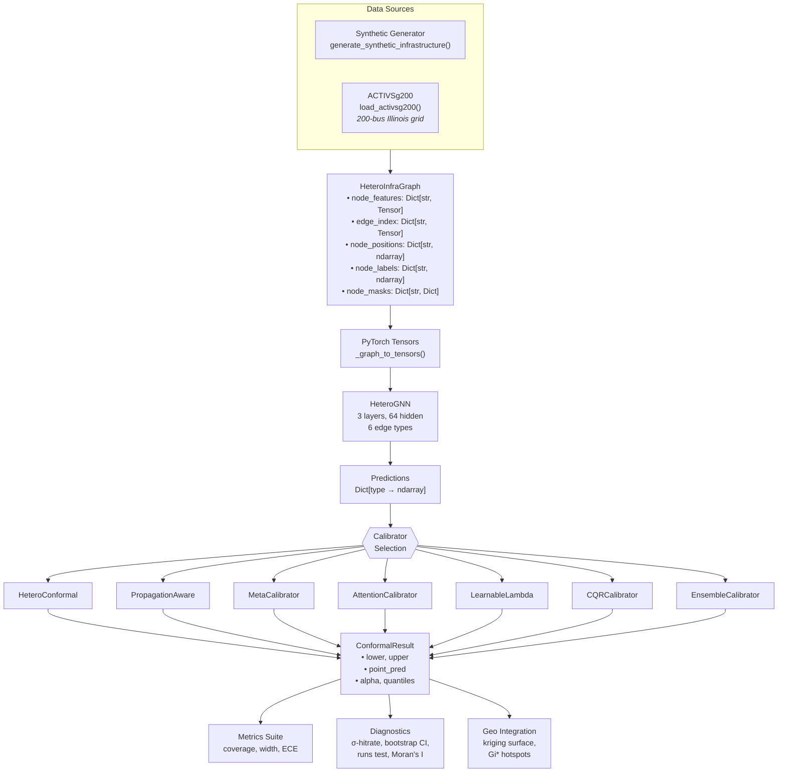

# STRATA Pipeline Flowchart

## Main Pipeline (for publication Figure 1)

```mermaid
flowchart TB
    subgraph INPUT["<b>Input: Heterogeneous Infrastructure Graph</b>"]
        direction LR
        P["🔴 Power Nodes<br/><i>200 substations</i><br/>tree topology"]
        W["🔵 Water Nodes<br/><i>150 treatment plants</i><br/>grid/mesh topology"]
        T["🟢 Telecom Nodes<br/><i>100 hub stations</i><br/>star-hub topology"]
        CE["⟷ Cross-Utility<br/>Coupling Edges"]
    end

    subgraph SPLIT["<b>Data Partitioning</b>"]
        direction LR
        TR["Train (60%)"]
        CAL["Calibration (20%)"]
        TEST["Test (20%)"]
    end

    subgraph GNN["<b>Heterogeneous GNN</b>"]
        direction TB
        IP["Per-Type Input<br/>Projection"]
        MP1["HeteroMessagePassing<br/>Layer 1<br/><i>per-edge-type W<sub>r</sub></i>"]
        MP2["HeteroMessagePassing<br/>Layer 2<br/><i>+ residual connection</i>"]
        MP3["HeteroMessagePassing<br/>Layer 3<br/><i>+ residual connection</i>"]
        OH["Per-Type Output<br/>Heads → ŷ<sub>i</sub>"]
        IP --> MP1 --> MP2 --> MP3 --> OH
    end

    subgraph TRAIN_PHASE["<b>Training Phase</b>"]
        direction TB
        MSE["MSE Loss on<br/>Train Nodes"]
        ES["Early Stopping<br/><i>patience = 20</i>"]
        FR["Freeze Training<br/>Residuals r<sub>j</sub> = |y<sub>j</sub> − ŷ<sub>j</sub>|"]
        MSE --> ES --> FR
    end

    subgraph CALIB["<b>Conformal Calibration</b><br/><i>(choose one)</i>"]
        direction TB
        subgraph CHMP["CHMP (Core Innovation)"]
            direction TB
            AGG["Aggregate Neighbor<br/>Residuals: r̄<sub>N(i)</sub>"]
            FLOOR["Apply Floor:<br/>r̄ ← max(r̄, floor_σ)"]
            SIGMA["Compute σ<sub>i</sub> = 1 + λ · r̄"]
            NORM["Normalize Scores:<br/>s<sub>i</sub> = |y<sub>i</sub> − ŷ<sub>i</sub>| / σ<sub>i</sub>"]
            QHAT["Per-Type Quantile:<br/>q̂<sub>t</sub> from cal scores"]
            AGG --> FLOOR --> SIGMA --> NORM --> QHAT
        end
        
        ADV["<b>Advanced Variants</b><br/>MetaCalibrator (learned σ)<br/>AttentionCalibrator (weighted)<br/>LearnableLambda (per-type λ*)<br/>CQR + propagation<br/>Ensemble (epistemic var)"]
    end

    subgraph PREDICT["<b>Prediction Intervals</b>"]
        direction TB
        INT["C<sub>i</sub> = [ŷ<sub>i</sub> − q̂<sub>τ(i)</sub> · σ<sub>i</sub>,<br/>  ŷ<sub>i</sub> + q̂<sub>τ(i)</sub> · σ<sub>i</sub>]"]
    end

    subgraph EVAL["<b>Evaluation & Diagnostics</b>"]
        direction LR
        COV["Marginal &<br/>Per-Type<br/>Coverage"]
        WIDTH["Mean<br/>Interval<br/>Width"]
        ECE["Expected<br/>Calibration<br/>Error"]
        SPATIAL["Spatial<br/>Diagnostics<br/><i>Moran's I</i><br/><i>Gi* Hotspots</i><br/><i>Kriging</i>"]
        STAT["Statistical<br/>Tests<br/><i>Wilcoxon</i><br/><i>Friedman</i><br/><i>Bootstrap CI</i>"]
    end

    INPUT --> SPLIT
    SPLIT --> GNN
    GNN --> TRAIN_PHASE
    TRAIN_PHASE --> CALIB
    CALIB --> PREDICT
    PREDICT --> EVAL

    style INPUT fill:#f9f0ff,stroke:#7c3aed,stroke-width:2px
    style GNN fill:#eff6ff,stroke:#2563eb,stroke-width:2px
    style TRAIN_PHASE fill:#fef3c7,stroke:#d97706,stroke-width:2px
    style CHMP fill:#ecfdf5,stroke:#059669,stroke-width:3px
    style CALIB fill:#f0fdf4,stroke:#16a34a,stroke-width:2px
    style PREDICT fill:#fef2f2,stroke:#dc2626,stroke-width:2px
    style EVAL fill:#f8fafc,stroke:#475569,stroke-width:2px
```

## Calibrator Comparison (for publication Figure 2)

## CHMP Detail (for publication Figure 3)

## Data Flow Architecture (for supplementary)

