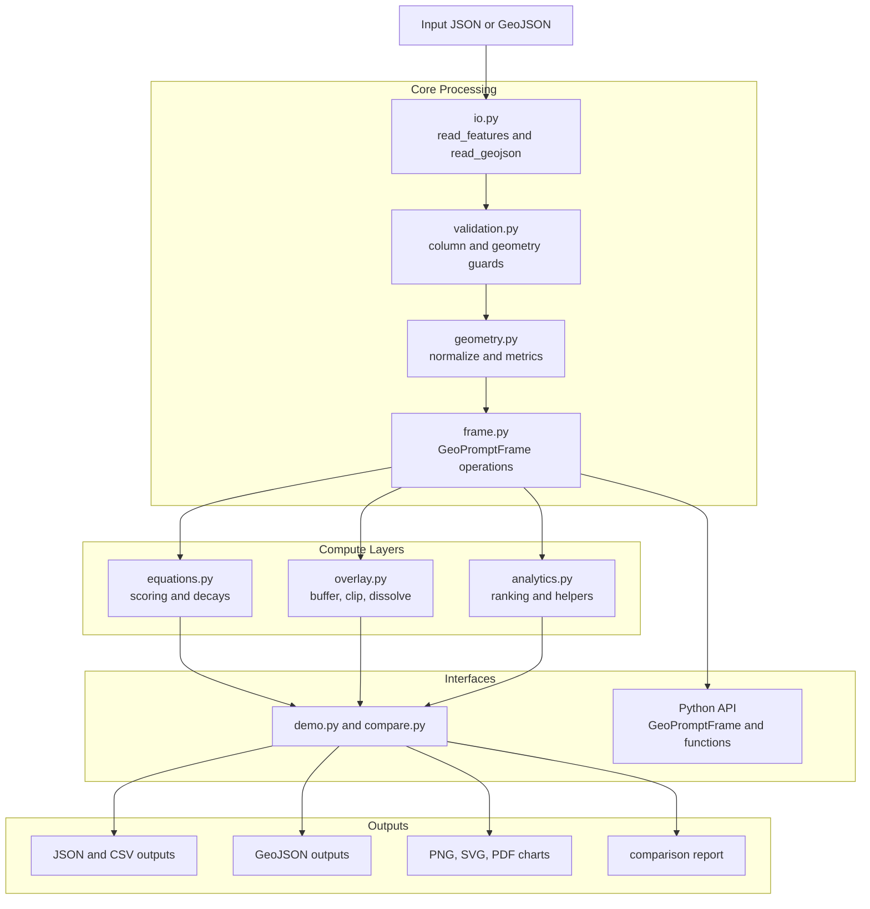

# Architecture

## Overview

This project models Geoprompt as a reusable package rather than a single spatial lab.

## Data Flow



## Pipeline Steps

1. JSON feature records or GeoJSON FeatureCollections are loaded into a `GeoPromptFrame`, optionally with CRS metadata.
2. Input validation checks required columns, geometry shapes, and CRS.
3. The frame normalizes point, line, polygon, and multi-geometry into a small internal geometry mapping.
4. Geometry helpers provide bounds, centroid, distance, length, area, predicate logic, coordinate transforms, and bounding-box relationship behavior.
5. Frame methods expose reusable spatial analysis primitives such as nearest neighbors, nearest joins, nearest assignment workflows, assignment summaries, map-window queries, radius queries, within-distance predicates, reprojection, spatial joins, proximity joins, buffer generation, buffer joins, coverage summaries, dissolve, clip operations, overlay intersections, interaction tables, area similarity tables, and corridor accessibility.
6. Custom GeoPrompt equations score decay, influence, corridor strength, area similarity, and pairwise interaction.
7. The demo CLI exports a JSON report, GeoJSON feature export, and a real review plot from the same package code.
8. The comparison CLI checks core Geoprompt outputs against Shapely and GeoPandas across a built-in corpus and records timing snapshots.

## Module Reference

### Core

| Module | Purpose |
|---|---|
| `geometry.py` | Geometry normalization, type detection, metrics (area, length, centroid, bounds) |
| `equations.py` | Pure-math decay, influence, interaction, corridor strength functions |
| `frame.py` | `GeoPromptFrame` — spatial analysis workbench with enrichment, queries, joins |
| `io.py` | Read/write JSON, GeoJSON, CSV |
| `overlay.py` | Shapely-backed overlay adapters (buffer, dissolve, clip, intersect) |
| `compare.py` | Metric parity validation against Shapely/GeoPandas |
| `demo.py` | CLI entry point, report builder, chart exporter |

### Infrastructure

| Module | Purpose |
|---|---|
| `exceptions.py` | Custom exception hierarchy (GeoPromptError, GeometryError, CRSError, etc.) |
| `validation.py` | Input validation guards for columns, geometry, CRS, numeric ranges |
| `types.py` | TypedDict models for structured outputs |
| `logging_.py` | Structured logging, timing context managers, trace mode |
| `config.py` | TOML-based configuration loader |

### Analytics & Extensions

| Module | Purpose |
|---|---|
| `plugins.py` | Pluggable decay functions and influence kernel registry |
| `normalization.py` | Min-max, z-score, and robust score normalization |
| `sensitivity.py` | Parameter sweep and sensitivity analysis |
| `analytics.py` | Extended analytics (Jaccard similarity, directional corridors, ranking) |

## Key Abstractions

### GeoPromptFrame

The central class. Wraps a list of feature dicts (GeoJSON-style) with
spatial analytics methods:

- `neighborhood_pressure()` — compute decay-weighted pressure from neighbors
- `anchor_influence()` — compute influence relative to a named anchor feature
- `corridor_accessibility()` — compute log-scaled corridor strength
- `interaction_table()` — pairwise origin-destination interaction matrix
- `area_similarity_table()` — pairwise area similarity scores
- `nearest_neighbors()` — k-nearest neighbor lookup (Euclidean or Haversine)
- `spatial_join()` — join with another frame via geometric predicate
- `to_crs()` — reproject all geometries to a new CRS
- `query()` — filter features by predicate function
- `assign()` — add computed columns

### Plugin System

Register custom decay functions via the plugin registry:

```python
from geoprompt.plugins import register_decay
register_decay("my_decay", lambda d, s, p: max(0, 1 - d/s))
```

## Deliberate Constraints

- GeoJSON-like point, line, polygon, and multi-geometry support
- CRS strings are supported, but full CRS objects and metadata models are not
- No pandas dependency
- Overlay support currently depends on Shapely and covers dissolve, clip, and pairwise intersections first
- GeoPandas and Shapely remain the reference engines for validation until Geoprompt covers more spatial operations

Those constraints are intentional. They keep the package easy to reason about while leaving room for later expansion into richer geometry and table behavior.