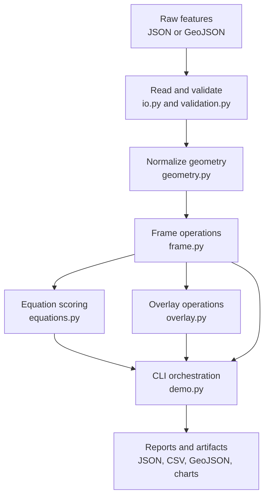

# Data Flow

```mermaid
flowchart TD
    A[Raw features\nJSON or GeoJSON]
    B[Read and validate\nio.py and validation.py]
    C[Normalize geometry\ngeometry.py]
    D[Frame operations\nframe.py]
    E[Equation scoring\nequations.py]
    F[Overlay operations\noverlay.py]
    G[CLI orchestration\ndemo.py]
    H[Reports and artifacts\nJSON, CSV, GeoJSON, charts]

    A --> B --> C --> D
    D --> E --> G
    D --> F --> G
    D --> G
    G --> H
```

This graph shows the end-to-end execution path for package and CLI workflows.