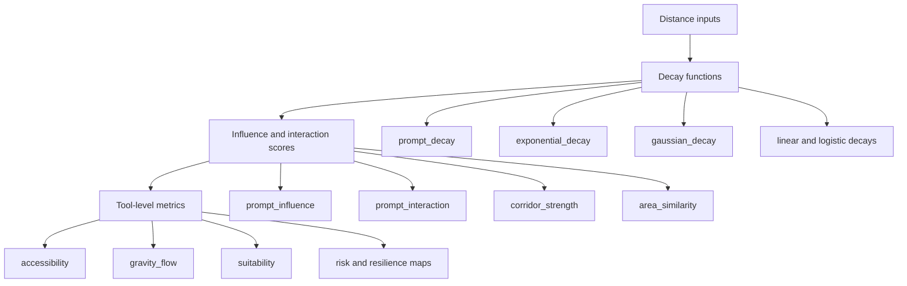

# GeoPrompt Equations

This document describes all spatial equations used in geoprompt, including
their mathematical definitions, assumptions, and caveats.

## Core Equations

## Equation Family Graph

### Prompt Decay

$$d(x, s, p) = \frac{1}{(1 + x / s)^p}$$

- **x**: distance between two features
- **s**: scale parameter (controls decay rate)
- **p**: power parameter (controls steepness)
- **Range**: (0, 1] — always positive, 1.0 at distance 0
- **Assumption**: Distance is non-negative; scale and power are positive

### Prompt Influence

$$I(w, x, s, p) = w \cdot d(x, s, p)$$

- **w**: feature weight (e.g., demand_index)
- Influence is the weighted decay

### Prompt Interaction

$$T(w_o, w_d, x, s, p) = w_o \cdot w_d \cdot d(x, s, p)$$

- **w_o**: origin weight
- **w_d**: destination weight
- Interaction is the product of both weights, decayed by distance

### Corridor Strength

$$C(w, L, x, s, p) = w \cdot \ln(1 + L) \cdot d(x, s, p)$$

- **L**: corridor length (geometry length of LineString features)
- Corridor strength rewards longer corridors via log scaling
- **Caveat**: Features with zero length (Points) produce zero corridor strength

### Area Similarity

$$A(a_1, a_2, x, s, p) = \frac{\min(a_1, a_2)}{\max(a_1, a_2)} \cdot d(x, s, p)$$

- **a_1, a_2**: areas of two polygon features
- Returns 1.0 when areas are identical and distance is zero
- **Caveat**: Returns 1.0 when both areas are zero (convention)

## Direction Equations

### Directional Bearing

$$\theta = \arctan2(\Delta x, \Delta y) \mod 360$$

- Returns compass bearing in degrees (0 = North, 90 = East)

### Directional Alignment

$$\alpha = \cos(\theta_{observed} - \theta_{preferred})$$

- Returns alignment score from -1 (opposite) to 1 (aligned)

## Distance Methods

### Euclidean Distance

$$d_E = \sqrt{(\Delta x)^2 + (\Delta y)^2}$$

- Suitable for projected CRS or small areas

### Haversine Distance

$$d_H = 2R \cdot \arctan2\left(\sqrt{a}, \sqrt{1-a}\right)$$

where $a = \sin^2(\Delta\phi/2) + \cos\phi_1 \cos\phi_2 \sin^2(\Delta\lambda/2)$

- Returns distance in kilometers
- Uses Earth radius = 6371.0088 km
- **Assumption**: Coordinates are (longitude, latitude) in decimal degrees

## Alternative Decay Functions (Plugins)

### Gaussian Decay

$$d_G(x, s) = e^{-(x/s)^2}$$

### Exponential Decay

$$d_X(x, s) = e^{-x/s}$$

### Linear Decay

$$d_L(x, s) = \max(0, 1 - x/s)$$

## Caveats and Assumptions

1. All distance computations use centroid-to-centroid distances.
2. Euclidean distance is unitless and assumes planar coordinates.
3. Haversine distance assumes a spherical Earth.
4. For CRS-dependent operations, reproject to a suitable projected CRS first.
5. Weight columns must contain numeric values; nulls are treated as 0.0.
6. Scale and power parameters must be positive.
7. Corridor strength is only meaningful for LineString features.
8. Area similarity requires Polygon features; Points and LineStrings return area 0.0.
