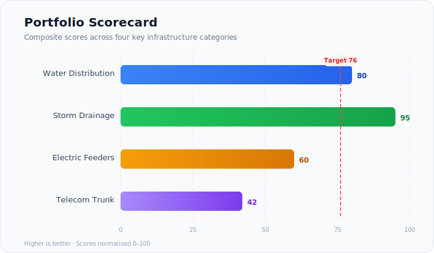
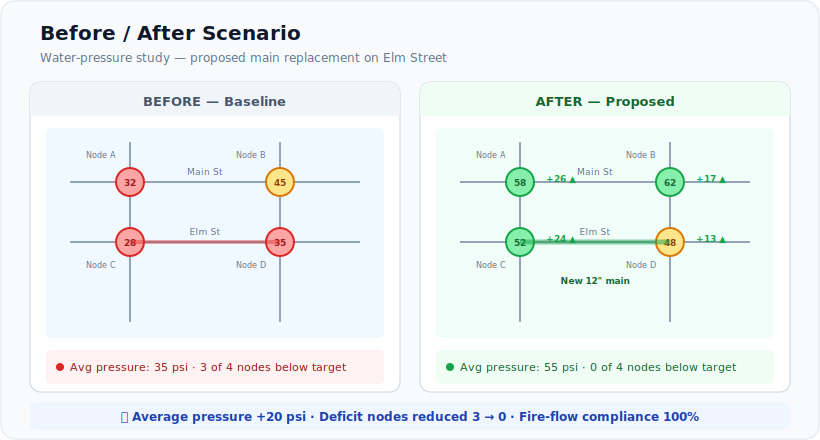
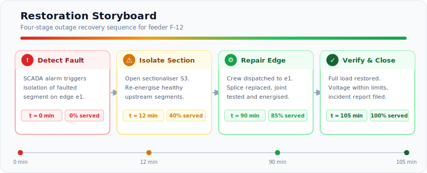
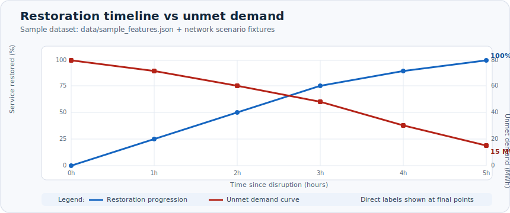
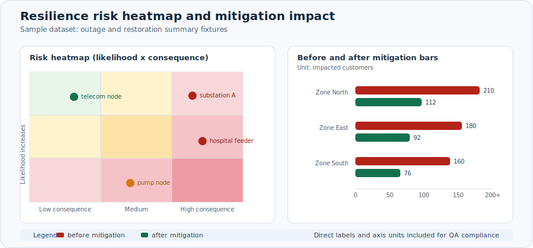
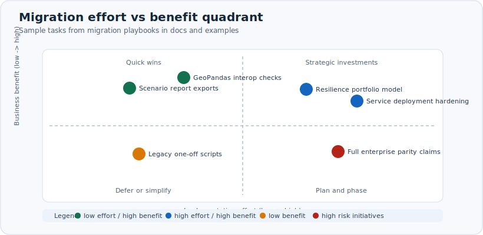

# Notebook and Output Gallery

This page provides rendered output references and teaching-friendly examples. The figures below were regenerated from real package data and scenario outputs during the latest quality audit.

Executed notebooks in the repository are committed with cached outputs so GitHub can render the results directly in the browser.

## Rendered Outputs

### Portfolio scorecard



Business context: use this for portfolio triage, capital prioritization, and stakeholder-ready rankings.

### Executive before and after scenario view



Business context: use this when a decision-maker needs a clear baseline-versus-candidate story with visible tradeoffs.

### Restoration storyboard



Business context: use this for outage, repair, restoration, and resilience sequencing walkthroughs.

### Network restoration and unmet demand



Business context: use this to communicate both service recovery pace and unmet demand burden in one visual.

### Resilience risk and mitigation impact



Business context: use this to prioritize high-risk assets and demonstrate mitigation value to operators and leadership.

### Migration effort and benefit planning



Business context: use this to sequence migration workstreams with fast wins first and high-effort investments staged.

## Scored gallery

| Notebook or output lane | Purpose | Typical runtime | Dependencies | Primary output files | Trust profile |
| --- | --- | --- | --- | --- | --- |
| Quickstart and analyst screen | fast scenario and triage walkthrough | low | core plus optional viz | scenario and resilience html/json bundles | stable-to-beta |
| Executive briefing pack | stakeholder-ready narrative outputs | low to medium | viz profile recommended | executive briefing html and comparison summary | beta |
| Network restoration walkthrough | outage and restoration sequencing | medium | network plus optional viz | restoration charts and resilience summaries | stable-to-beta |
| Benchmark proof bundle | reproducible comparison evidence | medium | compare profile | comparison json, html, dashboard outputs | beta with governance gates |

## Persona gallery

### Analyst track

- Start with the quickstart cookbook and the benchmark bundle.
- Focus on repeatable scenario comparison, summary tables, and map exports.
- Recommended outputs: HTML scorecards, CSV summaries, and choropleth maps.

### Planner track

- Start with the migration and connectors recipes.
- Focus on site screening, tradeoff comparison, and map-series generation.
- Recommended outputs: briefing packs, SVG figures, and narrative summaries.

### Operations track

- Start with the network scenario recipes and deployment guide.
- Focus on dispatch, restoration, and field coordination workflows.
- Recommended outputs: outage overlays, routing tables, and service-style reports.

## Teaching Flow

1. Start with the small quickstart example.
2. Run one persona script from the examples folder.
3. Export an HTML report or SVG map.
4. Compare outputs against the benchmark proof bundle.

## Notebook-Friendly Copy/Paste

```python
import geoprompt as gp

frame = gp.read_data("data/sample_features.json")
print(frame.head())
print(frame.summary())
print(frame.geom.area())
```
