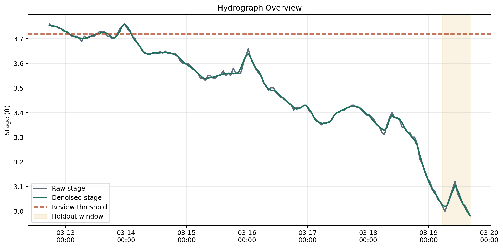

# Arroyo Flood Forecasting Lab

Data science portfolio project recreating the structure of an Arroyo Colorado flood-forecasting study with wavelet denoising, autoregressive model selection, and Monte Carlo scenario review.



## Snapshot

- Lane: Data science and flood forecasting
- Domain: Short-horizon river stage prediction
- Stack: Python, NumPy, Matplotlib, PyWavelets, USGS-backed JSON stage data
- Includes: hourly public stage series, wavelet denoising, AR order review, PMSE comparison, Monte Carlo forecast bands, chart export, tests

## Overview

This project translates a MATLAB-era flood forecasting workflow into a lightweight Python lab. It uses a real public USGS gage-height series from South Texas as a reproducible analog for an Arroyo-style flood review, denoises the signal with a discrete wavelet transform, compares autoregressive models on both the raw and denoised series, and exports a review artifact with holdout PMSE and Monte Carlo scenario summaries.

## What It Demonstrates

- Wavelet-based preprocessing before time-series forecasting
- Candidate AR order review using holdout PMSE and lag diagnostics
- Side-by-side raw-versus-denoised forecast comparison
- Monte Carlo scenario generation from model residual variance
- An object-oriented workflow class that matches the broader portfolio pattern

## Current Output

The default command writes `outputs/arroyo_flood_forecast_report.json` with:

- experiment metadata and persisted run-registry entries
- hydrograph summary and public-source threshold context
- ACF and PACF lag diagnostics for raw and denoised series
- AR candidate-order review for the raw and denoised inputs
- holdout forecasts and PMSE comparison across both model families
- Monte Carlo median, percentile bands, and review-threshold exceedance probabilities

It also writes a chart pack under `outputs/charts/` with:

- `hydrograph-overview.png`
- `lag-diagnostics.png`
- `pmse-by-order.png`
- `holdout-forecast-comparison.png`
- `threshold-exceedance-probability.png`
- `wavelet-benefit-comparison.png`

It also writes review summary artifacts at:

- `outputs/review-summary.html`
- `outputs/cross-site-comparison.html`
- `outputs/multi_site_comparison.json`

## Data Note

The checked-in series comes from the public USGS gauge [08211500, Nueces Rv at Calallen, TX](https://waterservices.usgs.gov/nwis/iv/?sites=08211500&parameterCd=00065&siteStatus=all&format=json&period=P7D). That site is not the Arroyo Colorado itself. It is used here as a reproducible South Texas analog so the workflow can be demonstrated with real public stage data.

The project also includes a second public South Texas gauge, Oso Creek at Corpus Christi, TX (`08211520`), so the workflow can compare whether wavelet denoising helps more on a noisier series.

## Run It

```bash
pip install -e .[dev]
arroyo-flood-lab
refresh-arroyo-flood-data
pytest
```

See [docs/architecture.md](docs/architecture.md) for the method notes.
See [docs/demo-storyboard.md](docs/demo-storyboard.md) for the reviewer walkthrough.
See [docs/case-study-walkthrough.md](docs/case-study-walkthrough.md) for an article-style narrative built around the generated artifacts.