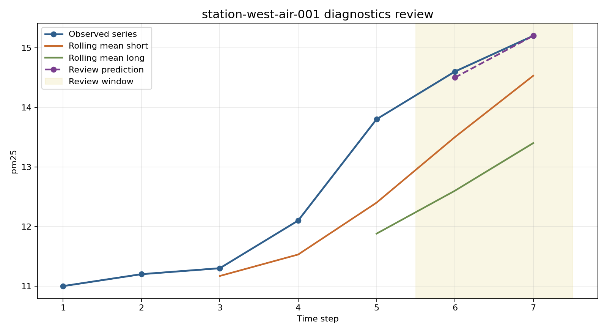

# Environmental Time Series Lab

Data science portfolio project for temporal diagnostics, baseline comparison, and reviewable time-series outputs across environmental monitoring stations.

## Snapshot

- Lane: Data science and time-series analysis
- Domain: Temporal diagnostics and signal review
- Stack: Python, JSON fixtures, split-based review windows, baseline comparison
- Includes: sample station histories, feature profiling, rolling means, seasonal fingerprints, change-point candidates, baseline leaderboard output, tests

## Overview

This project focuses on time-series analysis rather than GIS surface area. It loads small station histories, reserves a trailing review window, compares candidate baselines against that holdout segment, and exports structured diagnostics that can support monitoring review or later modeling work.

## What It Demonstrates

- Repeatable time-series summarization in a package structure
- An object-oriented lab workflow that can be extended without changing the public export interface
- Rolling averages for temporal smoothing at multiple windows
- Feature profiling for level, slope, recent change, and variability
- Seasonal phase summaries and seasonal-naive baseline comparison
- Change-point candidate summaries that flag likely mean shifts before downstream modeling
- Baseline leaderboard output for a held-out review window
- A persisted `outputs/run_registry.json` trail for exported runs
- Clean export artifacts for downstream reporting, diagnostics, or model preparation
- Real diagnostics charts under `outputs/charts/` showing observed series behavior, rolling means, and held-out review predictions

See [docs/architecture.md](docs/architecture.md) for the design notes.
See [docs/demo-storyboard.md](docs/demo-storyboard.md) for the reviewer walkthrough.