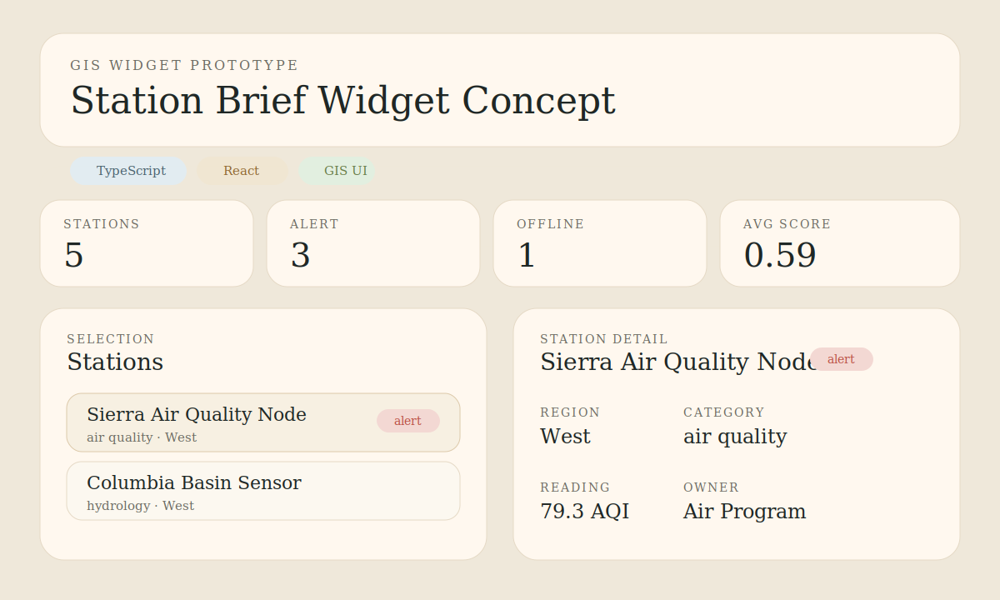

# Experience Builder Station Brief Widget

Public-safe TypeScript and React prototype of an ArcGIS Experience Builder style widget for station filtering, operational summaries, coverage-map interaction, and selection-driven detail panels.




## Snapshot

- Lane: GIS application development
- Domain: ArcGIS / Experience Builder style UI
- Stack: React, TypeScript, Vite, Vitest
- Includes: mock data source records, widget config pattern, coverage-map mock, summary cards, detail panel, tests

## Why This Project Exists

My public portfolio already showed backend, analytics, and database work. This project closes the remaining gap by demonstrating the kind of TypeScript and React interface work that maps closely to ArcGIS Experience Builder widget development, while staying safe to publish publicly.

It is designed to read as the frontend companion to the monitoring API and analytics repos rather than a disconnected UI demo.

## What It Demonstrates

- React and TypeScript component structure for GIS-facing UIs
- Widget-style configuration and data-source-driven rendering
- Local persistence of runtime widget configuration across page reloads
- Station filtering, summary cards, a map-adjacent mock, and selection-driven detail panels
- A public-safe way to discuss Experience Builder architecture without exposing private code

## Project Structure

```text
projects/experience-builder-station-brief-widget/
|-- src/
|   |-- App.tsx
|   |-- main.tsx
|   |-- styles.css
|   `-- widget/
|       |-- mockData.ts
|       |-- StationBriefWidget.tsx
|       |-- transform.ts
|       `-- types.ts
|-- tests/
|   `-- transform.test.ts
|-- assets/
|-- docs/
|-- package.json
|-- tsconfig.json
`-- vite.config.ts
```

## Quick Start

```bash
npm install
npm run dev
```

Run tests:

```bash
npm test
```

Build the demo:

```bash
npm run build
```

## Public Notes

This is not a full ArcGIS Experience Builder export. It is a deliberately public-safe prototype that demonstrates component structure, interaction patterns, and data-shaping logic relevant to Experience Builder widget work.

The configuration panel now persists key widget settings in browser local storage so a reviewer can see settings survive refresh without requiring a backend.

See [docs/architecture.md](docs/architecture.md) for the widget design notes.
See [docs/demo-storyboard.md](docs/demo-storyboard.md) for a short walkthrough script.