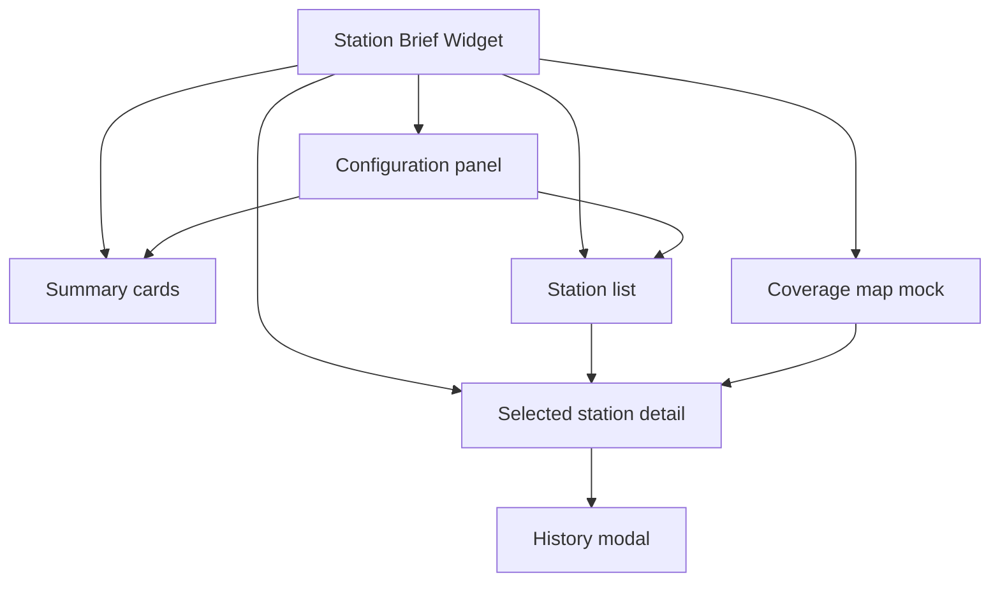

# Site Map

This repo is a widget-style interface, so the site map is best read as a panel map.

## Reviewer Path

1. Start with the configuration panel.
2. Filter the visible stations.
3. Use the station list and coverage map together.
4. Open the detail panel and history modal for the inspection flow.
