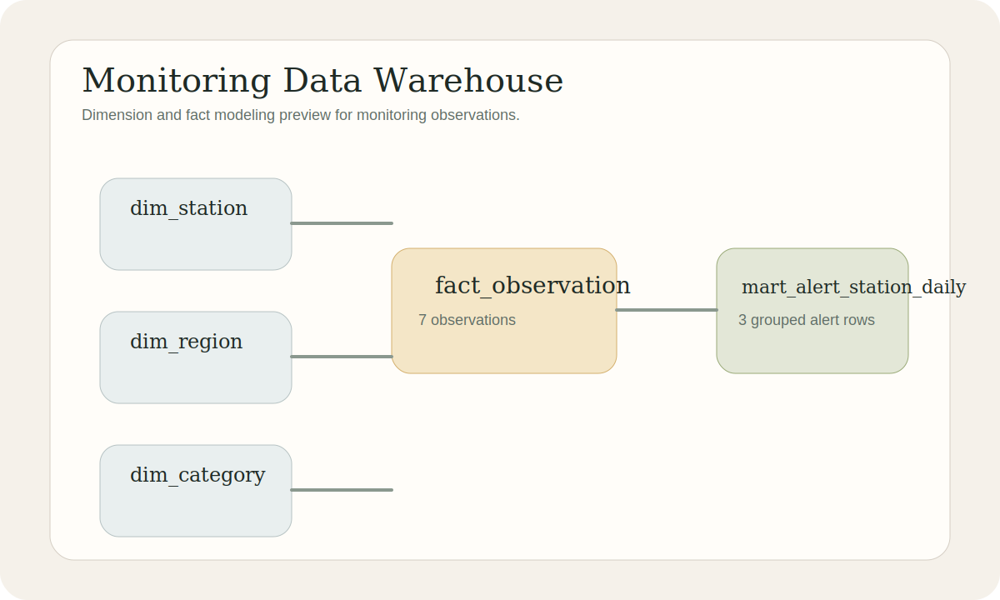

# Monitoring Data Warehouse

Database-engineering project for modeling, building, and validating a monitoring warehouse from operational station data.



## Overview

This project represents the database-engineering lane of the portfolio. It starts from raw station observations, builds a small warehouse model with dimensions and facts, and runs validation queries that are closer to platform engineering than analytics notebooks.

## What It Demonstrates

- Warehouse-style schema design
- Dimension and fact table modeling
- Repeatable SQL execution against DuckDB
- Data quality checks for operational datasets
- A portfolio lane focused on database structure and reliability

## Warehouse Model

- `dim_station`
- `dim_region`
- `dim_category`
- `fact_observation`
- `mart_alert_station_daily`

## Quick Start

```bash
pip install -e .[dev]
python -m monitoring_data_warehouse.builder
```

## Outputs

- A local DuckDB warehouse file
- Row-count and quality-check summary
- A sample daily alert mart

See [docs/model-notes.md](docs/model-notes.md) for the modeling rationale behind the warehouse shape.
See [docs/architecture.md](docs/architecture.md) for the warehouse build flow.

## Next Steps

- Add dbt-style dependency metadata
- Add slowly changing dimension examples
- Add partitioning and retention strategy notes for PostgreSQL migration

## Publication

See [PUBLISHING.md](PUBLISHING.md) for the standalone repository plan.