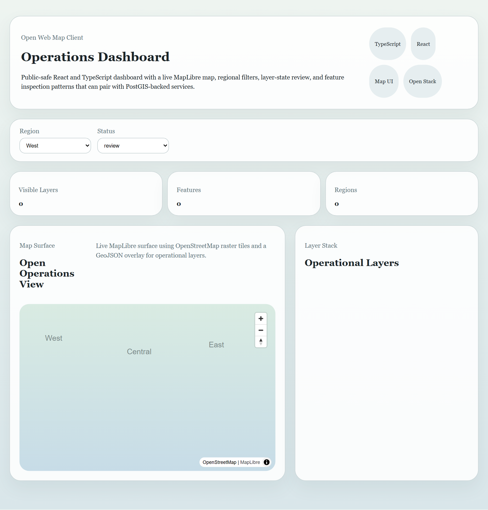

# Open Web Map Operations Dashboard

Open-stack GIS frontend project for reviewing operational layers, regional filters, and map-driven status patterns without relying on vendor-specific UI framing.



## Snapshot

- Lane: Open web mapping
- Domain: Operational layer review and feature inspection
- Stack: React, TypeScript, Vite, MapLibre
- Includes: sample layer data, live map surface, filters, tests

## Overview

This project starts the open web mapping lane that follows the PostGIS service blueprint. It is designed as the frontend counterpart to the open spatial publishing work: a lightweight dashboard that can consume PostGIS-backed services, vector tiles, or GeoJSON feeds.

The current implementation is public-safe and intentionally self-contained. It uses checked-in sample data, MapLibre, and OpenStreetMap raster tiles to show operational map review patterns without depending on private service endpoints.

## What It Demonstrates

- React and TypeScript structure for open-stack GIS interfaces
- Region and status filters for operational review
- A live MapLibre surface with a GeoJSON overlay for layer review
- Layer cards that read as a map-side operations panel rather than a generic admin list

## Project Structure

```text
open-web-map-operations-dashboard/
|-- data/
|   `-- dashboard_layers.json
|-- assets/
|   `-- dashboard-live-screenshot.png
|-- scripts/
|   `-- capture-demo.mjs
|-- src/
|   |-- App.tsx
|   |-- main.tsx
|   |-- styles.css
|   `-- map/
|       |-- MapCanvas.tsx
|       |-- summary.ts
|       `-- types.ts
|-- tests/
|   `-- app.test.tsx
|-- docs/
|   |-- architecture.md
|   |-- demo-storyboard.md
|   `-- site-map.md
|-- package.json
|-- tsconfig.json
`-- vite.config.ts
```

## Quick Start

```bash
npm install
npm run dev
```

Run tests:

```bash
npm test
```

Build the app:

```bash
npm run build
```

Refresh the committed screenshot:

```bash
npm run capture:demo
```

## Current Output

The current dashboard includes:

- a filterable layer list
- a live MapLibre map backed by OpenStreetMap raster tiles
- operational layer counts and feature totals
- a GeoJSON overlay generated from the checked-in layer metadata
- a local browser-ready demo surface available through `npm run dev`
- a committed browser screenshot in `assets/dashboard-live-screenshot.png`

The screenshot is captured from the local Vite preview with `npm run capture:demo`. If the UI changes, regenerate the asset instead of replacing it with mock illustration art.

See [docs/architecture.md](docs/architecture.md) for the design notes.
See [docs/demo-storyboard.md](docs/demo-storyboard.md) for the reviewer walkthrough.
See [docs/site-map.md](docs/site-map.md) for the interface map.

Primary demo asset type: browser screenshot.
Secondary review surface: live dashboard run locally with `npm run dev`.
Preferred second asset type when captured: short GIF of the filter-to-map workflow.

## Publication

- License: [LICENSE](LICENSE)
- Standalone publishing notes: [PUBLISHING.md](PUBLISHING.md)
- Local CI workflow: [.github/workflows/ci.yml](.github/workflows/ci.yml)

## Repository Notes

This copy is intended to be publishable as its own repository.
