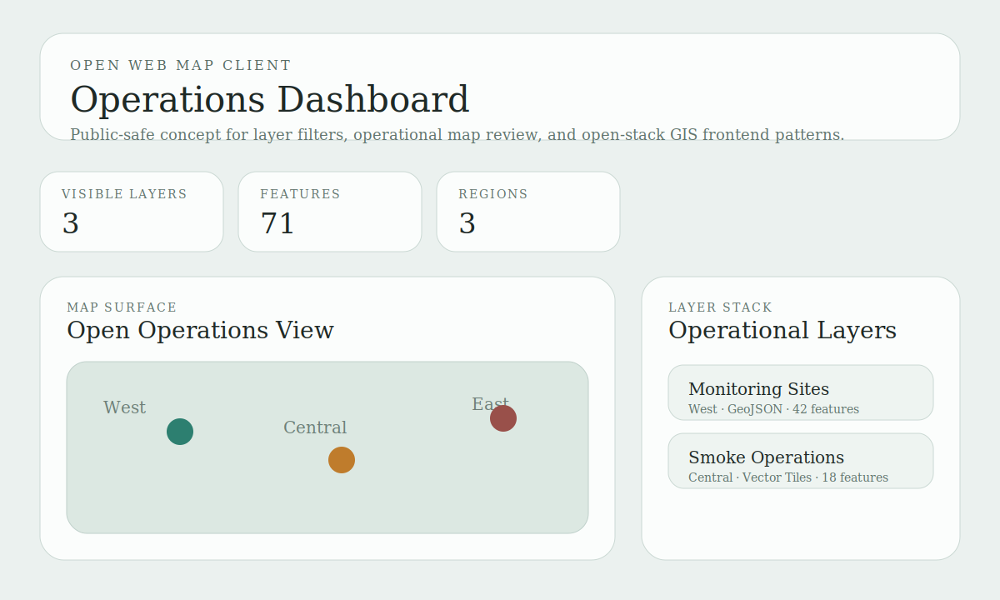

# Open Web Map Operations Dashboard

Open-stack GIS frontend project for reviewing operational layers, regional filters, and map-driven status patterns without relying on vendor-specific UI framing.



## Snapshot

- Lane: Open web mapping
- Domain: Operational layer review and feature inspection
- Stack: React, TypeScript, Vite
- Includes: sample layer data, conceptual map surface, filters, tests

## Overview

This project starts the open web mapping lane that follows the PostGIS service blueprint. It is designed as the frontend counterpart to the open spatial publishing work: a lightweight dashboard that can later consume PostGIS-backed services, vector tiles, or GeoJSON feeds.

The current implementation is public-safe and intentionally self-contained. It uses checked-in sample data to show operational map review patterns without depending on external map SDKs or private service endpoints.

## What It Demonstrates

- React and TypeScript structure for open-stack GIS interfaces
- Region and status filters for operational review
- A conceptual map surface that can later be replaced with MapLibre or OpenLayers
- Layer cards that read as a map-side operations panel rather than a generic admin list

## Project Structure

```text
open-web-map-operations-dashboard/
|-- data/
|   `-- dashboard_layers.json
|-- src/
|   |-- App.tsx
|   |-- main.tsx
|   |-- styles.css
|   `-- map/
|       |-- MapCanvas.tsx
|       |-- summary.ts
|       `-- types.ts
|-- tests/
|   `-- app.test.tsx
|-- assets/
|   `-- dashboard-preview.svg
|-- docs/
|   |-- architecture.md
|   `-- demo-storyboard.md
|-- package.json
|-- tsconfig.json
`-- vite.config.ts
```

## Quick Start

```bash
npm install
npm run dev
```

Run tests:

```bash
npm test
```

Build the app:

```bash
npm run build
```

## Current Output

The current dashboard includes:

- a filterable layer list
- a conceptual open web map surface
- operational layer counts and feature totals
- a visual structure ready for a future MapLibre or OpenLayers implementation

See [docs/architecture.md](docs/architecture.md) for the design notes.
See [docs/demo-storyboard.md](docs/demo-storyboard.md) for the reviewer walkthrough.

## Publication

- License: [LICENSE](LICENSE)
- Standalone publishing notes: [PUBLISHING.md](PUBLISHING.md)
- Local CI workflow: [.github/workflows/ci.yml](.github/workflows/ci.yml)

## Repository Notes

This copy is intended to be publishable as its own repository.
