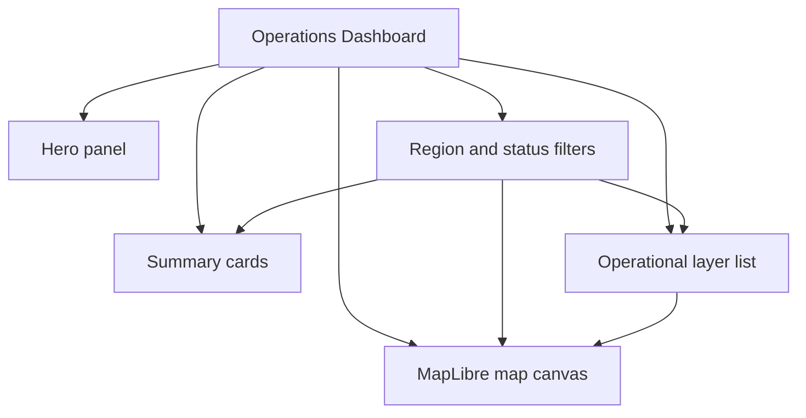

# Site Map

This repo is a single-page dashboard, so the site map is an interface map rather than a route tree.

## Reviewer Path

1. Start at the hero panel for project framing.
2. Change region and status filters.
3. Confirm the summary cards and map update together.
4. Review the layer cards as the supporting inspection panel.
