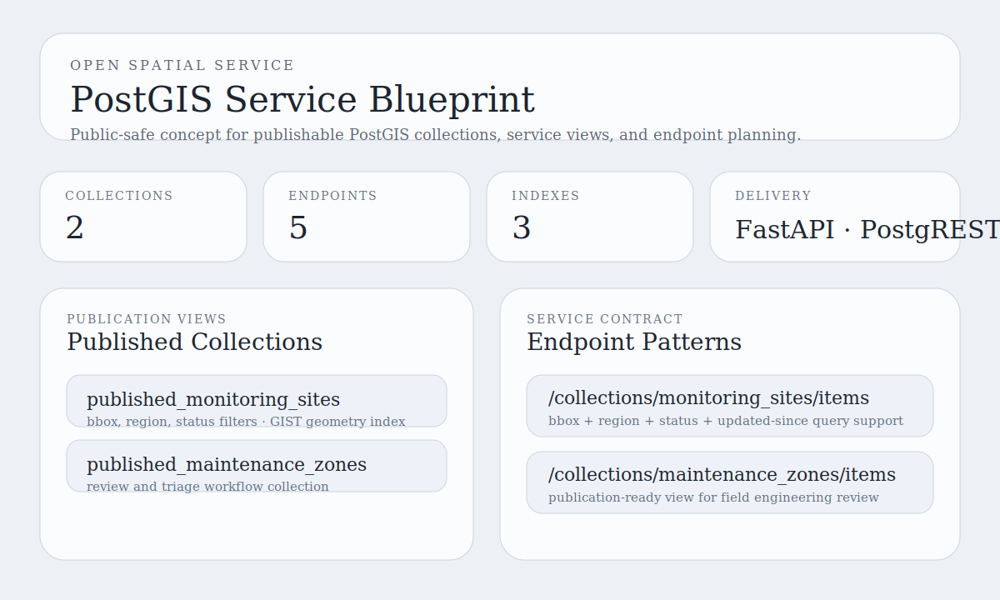

# PostGIS Service Blueprint

Open-stack GIS portfolio project for shaping how PostGIS-backed layers become publishable spatial services.



## Snapshot

- Lane: Spatial services and data publishing
- Domain: PostGIS-first service design
- Stack: Python, SQL, GeoJSON, PostgreSQL/PostGIS planning
- Includes: sample spatial layers, SQL schema, publication views, exported blueprint artifact, tests

## Overview

This project starts the next open spatial service lane after the desktop QGIS workbench. It focuses on the service-design side of geospatial engineering: what gets stored in PostGIS, which views are safe to publish, and how a service contract should look before a delivery layer is built.

The current implementation stays lightweight and public-safe. It exports a JSON blueprint artifact and includes SQL for schema and publication views so the project is useful before a full API or PostgREST deployment is added.

## What It Demonstrates

- Clear separation between source tables and publication-ready views
- PostGIS-oriented indexing and collection planning
- Spatial service contract design for bbox and attribute filters
- A bridge between sample spatial data and future delivery through FastAPI, PostgREST, or OGC API Features

## Project Structure

```text
postgis-service-blueprint/
|-- data/
|   `-- service_layers.geojson
|-- sql/
|   |-- schema.sql
|   `-- service_views.sql
|-- src/postgis_service_blueprint/
|   |-- __init__.py
|   `-- blueprint.py
|-- tests/
|   `-- test_blueprint.py
|-- assets/
|   `-- service-preview.svg
|-- docs/
|   |-- architecture.md
|   `-- demo-storyboard.md
|-- outputs/
|   `-- .gitkeep
|-- pyproject.toml
`-- README.md
```

## Quick Start

```bash
pip install -e .[dev]
python -m postgis_service_blueprint.blueprint
```

Run tests:

```bash
pytest
```

Generate the blueprint with a custom service name:

```bash
python -m postgis_service_blueprint.blueprint --service-name "Regional Spatial Service"
```

## Current Output

The default command writes `outputs/postgis_service_blueprint.json` with:

- collection metadata grouped by layer
- service endpoints and query patterns
- publication-plan notes for PostGIS indexes and delivery options
- bounds and summary counts for the sample layers

See [docs/architecture.md](docs/architecture.md) for the design notes.
See [docs/demo-storyboard.md](docs/demo-storyboard.md) for the reviewer walkthrough.

## Publication

- License: [LICENSE](LICENSE)
- Standalone publishing notes: [PUBLISHING.md](PUBLISHING.md)
- Local CI workflow: [.github/workflows/ci.yml](.github/workflows/ci.yml)

## Repository Notes

This copy is intended to be publishable as its own repository.
