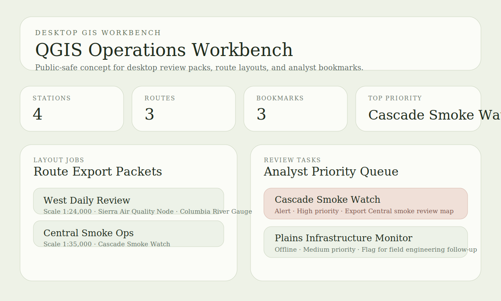

# QGIS Operations Workbench

Desktop GIS portfolio project for packaging repeatable QGIS-oriented review workflows, layout tasks, bookmarks, and field-ready inspection context.



## Snapshot

- Lane: Desktop GIS and operations workflows
- Domain: QGIS-oriented analyst tooling
- Stack: Python, GeoJSON, CSV, QGIS workflow design
- Includes: sample station layer, inspection routes, generated workbench pack, GeoPackage export, tests

## Overview

This project starts the next non-Esri repo wave by focusing on a workstation-style GIS review flow. Instead of presenting a web app, it packages the information an analyst would want before opening QGIS: operational stations, route-oriented layouts, bookmarks, and prioritized review tasks.

The current implementation is intentionally public-safe and runnable without a local QGIS install. It generates a workbench pack JSON artifact that documents the layer, theme, bookmark, and layout structure that a fuller PyQGIS project can automate later.

It also generates a GeoPackage bundle that can be opened directly in QGIS, which makes the repo immediately useful as a desktop GIS review starting point instead of a documentation-only scaffold.

## What It Demonstrates

- Python tooling for repeatable GIS analyst preparation
- A clean handoff between sample monitoring data and desktop review tasks
- Region bookmarks and map-theme planning for review sessions
- Route-driven layout job definitions for export packets
- GeoPackage packaging for desktop handoff into QGIS
- A repo structure that can grow into PyQGIS and GDAL automation without throwing away the current scaffold

## Why This Project Exists

The portfolio already showed backend GIS, analytics, warehouse design, and a frontend widget prototype. This project adds the missing desktop GIS lane with a QGIS-oriented workflow that is distinct from the Esri-facing work already in the portfolio.

## Project Structure

```text
qgis-operations-workbench/
|-- data/
|   |-- inspection_routes.csv
|   `-- station_review_points.geojson
|-- src/qgis_operations_workbench/
|   |-- __init__.py
|   `-- workbench.py
|-- tests/
|   `-- test_workbench.py
|-- assets/
|   `-- workbench-preview.svg
|-- docs/
|   |-- architecture.md
|   `-- demo-storyboard.md
|-- outputs/
|   `-- .gitkeep
|-- pyproject.toml
`-- README.md
```

## Quick Start

```bash
pip install -e .[dev]
python -m qgis_operations_workbench.workbench
python -m qgis_operations_workbench.workbench --export-geopackage
```

Run tests:

```bash
pytest
```

Generate the workbench pack in a custom location:

```bash
python -m qgis_operations_workbench.workbench --output-dir outputs --project-name "Regional Desktop GIS Review"
```

## Current Output

The default command writes `outputs/qgis_workbench_pack.json` with:

- layer metadata for the checked-in station points
- route-based layout jobs
- region bookmarks
- map-theme groupings
- prioritized analyst review tasks

With `--export-geopackage`, the command also writes `outputs/qgis_review_bundle.gpkg` containing:

- a `station_review_points` feature layer in EPSG:4326
- an `inspection_routes` attribute table for layout and route review
- GeoPackage metadata tables so the bundle can be loaded in QGIS directly

See [docs/architecture.md](docs/architecture.md) for the design notes.
See [docs/demo-storyboard.md](docs/demo-storyboard.md) for the review walkthrough.
See [docs/geopackage-workflow.md](docs/geopackage-workflow.md) for the desktop handoff details.

## Publication

- License: [LICENSE](LICENSE)
- Standalone publishing notes: [PUBLISHING.md](PUBLISHING.md)
- Local CI workflow: [.github/workflows/ci.yml](.github/workflows/ci.yml)

## Repository Notes

This copy is intended to be publishable as its own repository.
