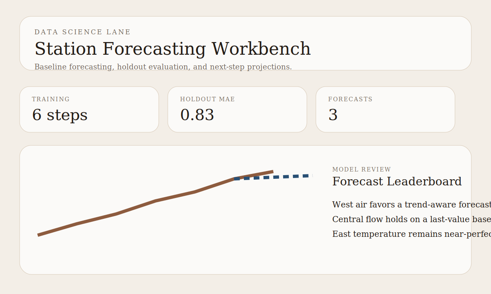

# Station Forecasting Workbench

Data science portfolio project for experiment-style model comparison, train-validation-test evaluation, feature profiling, and station-level projection artifacts.

## Snapshot

- Lane: Data science and forecasting
- Domain: Short-horizon monitoring projections
- Stack: Python, JSON fixtures, lightweight forecasting workbench
- Includes: station histories, feature profiles, model leaderboard, validation/test evaluation, projections, tests

## Overview

This project frames data science as a forecasting workflow rather than just descriptive analytics. It loads small station histories, builds simple feature profiles, compares several candidate models, selects them on a validation split, records test performance separately, and exports a concise forecast review package with experiment-style metadata.

## What It Demonstrates

- Candidate-model comparison across naive, trailing-average, drift, and linear-regression forecasts
- Validation-first model selection with separate test evaluation
- Lightweight feature profiling for recent level, volatility, momentum, and slope
- A reviewable output artifact that looks more like an experiment workbench than a single hard-coded baseline

## Current Output

The default command writes `outputs/station_forecast_report.json` with:

- experiment run metadata and split configuration
- station feature profiles
- model leaderboard entries and validation MAE by station
- selected forecast model per series
- post-selection test MAE by station
- future projections from the winning model

## Next Upgrade Path

- add a lightweight run registry across multiple report files
- compare richer feature sets, not just model families
- plug in external experiment tracking once the repo needs persisted run history

See [docs/architecture.md](docs/architecture.md) for the design notes.
See [docs/demo-storyboard.md](docs/demo-storyboard.md) for the reviewer walkthrough.