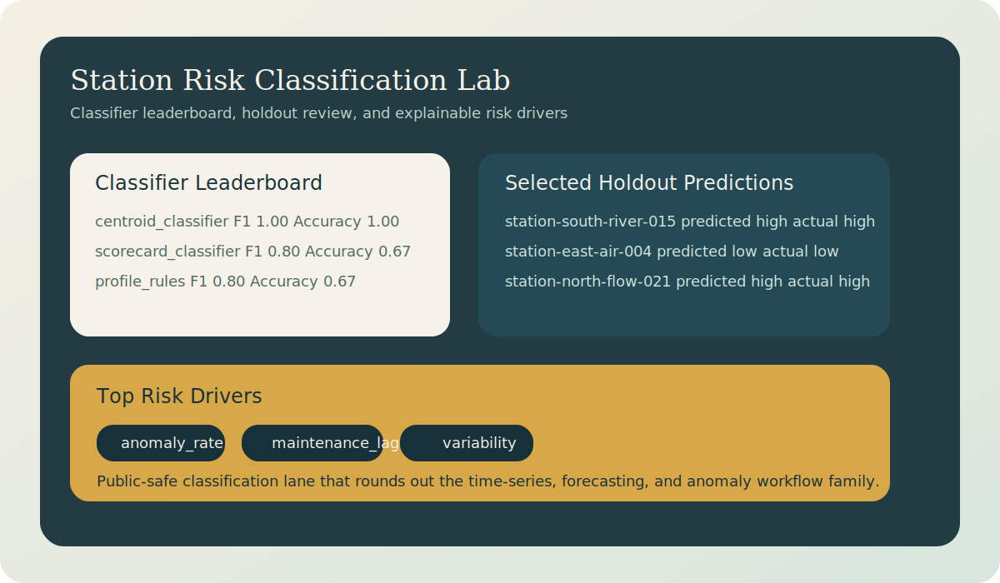

# Station Risk Classification Lab

Data science portfolio project for station risk scoring, candidate classifier comparison, and explainable review outputs that support alert prioritization.



## Snapshot

- Lane: Data science and classification
- Domain: Operational risk triage
- Stack: Python, JSON fixtures, lightweight classification workflow
- Includes: sample station feature vectors, candidate model leaderboard, explainable test predictions, persisted run registry, tests

## Overview

This project extends the portfolio from time-series review and anomaly detection into classification. It treats each station snapshot as a compact feature vector, compares a few public-safe candidate classifiers, and exports a report that can support analyst queues, escalation rules, or downstream model expansion.

The implementation stays dependency-light while still following the same object-oriented report workflow used in the other data-science repos.

## What It Demonstrates

- A class-based classification workflow with the same export pattern as the other data-science projects
- Candidate model comparison across scorecard, centroid, and profile-rule classifiers
- Explainable risk drivers for each selected prediction
- Holdout-style evaluation with accuracy, precision, recall, and F1
- Clean JSON output for dashboards, triage queues, or later model prototyping

## Project Structure

```text
station-risk-classification-lab/
|-- data/
|   `-- station_risk_samples.json
|-- src/station_risk_classification_lab/
|   |-- __init__.py
|   |-- workflow_base.py
|   `-- lab.py
|-- tests/
|   `-- test_lab.py
|-- assets/
|   `-- classification-preview.svg
|-- docs/
|   |-- architecture.md
|   `-- demo-storyboard.md
|-- outputs/
|   `-- .gitkeep
|-- pyproject.toml
`-- README.md
```

## Quick Start

```bash
pip install -e .[dev]
python -m station_risk_classification_lab.lab
```

Run tests:

```bash
pytest
```

## Current Output

The default command writes `outputs/station_risk_report.json` with:

- experiment run metadata and class-balance summary
- a persisted `outputs/run_registry.json` entry for each export
- candidate classifier leaderboard metrics
- holdout predictions from the selected classifier
- top risk drivers for each reviewed station
- operational notes for triage and extension

See [docs/architecture.md](docs/architecture.md) for the design notes.
See [docs/demo-storyboard.md](docs/demo-storyboard.md) for the reviewer walkthrough.