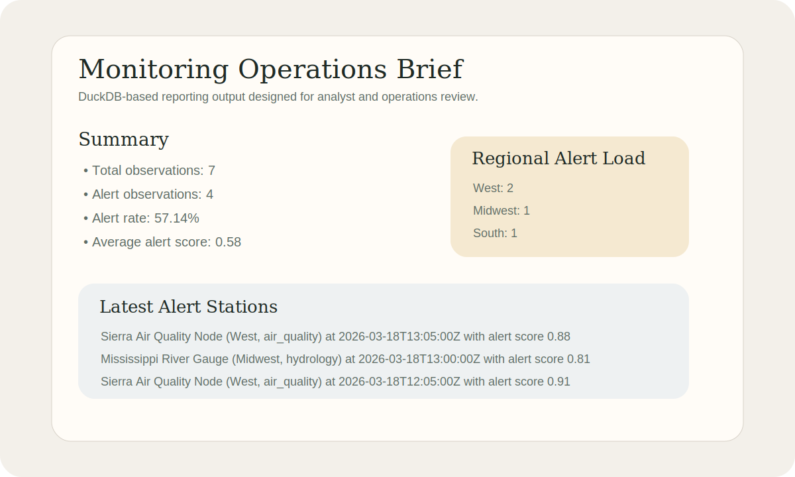

# Environmental Monitoring Analytics

Analytics project for turning monitoring station observations into concise operational reporting and shareable HTML summaries.




## Snapshot

- Lane: Analytics
- Domain: Environmental monitoring
- Stack: DuckDB, SQL, Python
- Includes: operational brief generation, sample reporting output, tests

## Overview

This project focuses on the analytics lane of the portfolio. It uses DuckDB to query a flat observation dataset, calculate alert-oriented metrics, and generate both a markdown operations brief and an HTML summary with visual regional alert bars.

It is intentionally small and fast to run so a reviewer can move from raw data to a presentable operations brief in a few minutes.

## What It Demonstrates

- SQL-first analytics with DuckDB
- Repeatable reporting from raw observation data
- Operational metrics for alert rates and regional coverage
- A reporting workflow that emphasizes analysis instead of API design

## Why This Project Exists

Many data portfolios stop at notebooks. This repository shows a tighter reporting pattern: take raw operational data, compute the key monitoring signals, and produce a concise artifact that can be regenerated consistently.

## Dataset

The sample dataset models station observations with:

- station identifiers and names
- monitoring categories
- regions
- observation timestamps
- status values
- alert scores
- reading values

## Project Structure

```text
environmental-monitoring-analytics/
|-- data/
|-- src/environmental_monitoring_analytics/
|   |-- __init__.py
|   `-- reporting.py
|-- tests/
|   `-- test_reporting.py
|-- pyproject.toml
`-- README.md
```

## Quick Start

```bash
pip install -e .[dev]
python -m environmental_monitoring_analytics.reporting
python -m environmental_monitoring_analytics.reporting --input data/api_observation_snapshot.json
```

The default command uses the checked-in CSV sample. The optional `--input` path also accepts an API-derived JSON snapshot bundle.

## Why It Is Useful In A Portfolio

- Shows SQL and Python working together without requiring a full warehouse or web stack
- Demonstrates repeatable reporting rather than exploratory-only analysis
- Gives reviewers a small project they can run quickly and understand end to end

## Current Outputs

- Total observation count
- Alert rate
- Average alert score
- Regional alert breakdown
- Time-window trend analysis with recent vs previous alert-rate comparison
- Latest alert stations section in markdown
- Exportable HTML brief with visual summary blocks and regional alert bars
- Support for API-derived JSON snapshot input in addition to the local CSV sample

See [docs/sample-operations-brief.md](docs/sample-operations-brief.md) for a sample generated brief.
See [docs/sample-operations-brief.html](docs/sample-operations-brief.html) for a sample generated HTML brief.
See [docs/architecture.md](docs/architecture.md) for the reporting flow overview.
See [docs/api-snapshot-contract.md](docs/api-snapshot-contract.md) for the snapshot input contract.

## API Snapshot Workflow

This project can consume a JSON bundle derived from the API lane as long as it contains feature metadata and observations in the documented snapshot shape.

```powershell
$bundle = @{
	source = @{
		project = 'spatial-data-api'
		capturedAt = (Get-Date).ToUniversalTime().ToString('yyyy-MM-ddTHH:mm:ssZ')
	}
	features = Invoke-RestMethod http://localhost:8000/api/v1/features
	observations = Invoke-RestMethod "http://localhost:8000/api/v1/observations/recent?limit=50"
}

$bundle | ConvertTo-Json -Depth 8 | Set-Content data/api_observation_snapshot.json
python -m environmental_monitoring_analytics.reporting --input data/api_observation_snapshot.json
```

The included [data/api_observation_snapshot.json](data/api_observation_snapshot.json) file is a checked-in example of that bundle shape.

## Next Steps

- Add parameterized report windows for longer operational comparisons
- Add support for larger exported snapshots and batch comparisons

## Publication

- License: [LICENSE](LICENSE)
- Standalone publishing notes: [PUBLISHING.md](PUBLISHING.md)

## Repository Notes

This copy is intended to be publishable as its own repository. CI is included in [.github/workflows/ci.yml](.github/workflows/ci.yml).